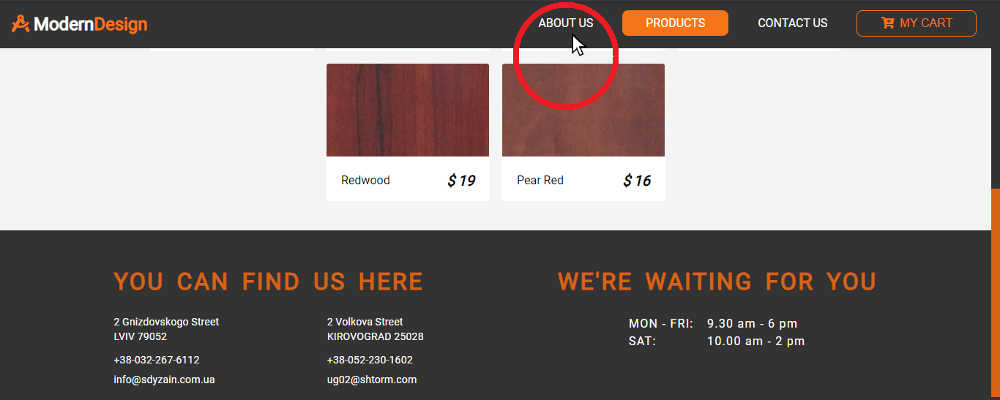

# ReactSnippet: How To

---

## Get Top Of The Page On Every Transition

---

### Description
It is necessary to get the top of the page when navigating from one page to another of the current website.
The image below shows an example: the user is on page PRODUCTS and wants to go to page ABOUT US


<br/>

It is likely that the new page will be in the same position as the previous one (at the bottom if the previous one was at the bottom)

<br/>

<br/>

Such features is not friendly for user interface, especially when the page content is very long. Most likely, the user wants to get to the top of the page, as shown in the illustration below

<br/>


### How to fix this issue?

Solutions suggested with [React Router](https://reactrouter.com/web/guides/scroll-restoration) <br/>
Code files [here](src) <br/>

#### Step 1
You need to create a component that fixes this issue

```JavaScript
const ScrollToTop = () => {
    //your code
}

export default ScrollToTop
```
#### Step 2
Since after rendering you will need additional functionality - to get to the top of the page, then add [the Effect Hook](https://reactjs.org/docs/hooks-effect.html). It helps to perform side effects

```JavaScript
import { useEffect } from 'react';

const ScrollToTop = () => {

    useEffect(() => {
        //your code
    });
}

export default ScrollToTop
```
#### Step 3
Our current window is represented by a global variable `window`. It includes [scrollTo(x-coord, y-coord)](https://developer.mozilla.org/en-US/docs/Web/API/Window/scrollTo) function that scrolls to a particular position in the document. Top coordinates is (0,0). And our `useEffect` will be as follows

```JavaScript
useEffect(() => {
    window.scrollTo(0, 0);
});
```
#### Step 4
To invoke the effect only on navigating, and not after every render. Add a second parameter to `useEffect` that tracks such changes

```JavaScript
const pathname;

useEffect(() => {
    // your code
}, [pathname]);
```
#### Step 5
In order to know the current URL is used the `location` object. The _useLocation_ hook from [React Router](https://reactrouter.com/web/api/Hooks/uselocation) returns it

```JavaScript
import { useEffect } from 'react';
import { useLocation } from "react-router-dom";
    // your code
```

```JavaScript
const { pathname } = useLocation();

useEffect(() => {
    // your code
}, [pathname]);
```
#### Step 6
Since our component generates no content, the function will return `null`

```JavaScript
import { useEffect } from 'react';
import { useLocation } from "react-router-dom";

const ScrollToTop = () => {
    // your code
    
    return null;
}

export default ScrollToTop
```
#### Step 7
The last thing we need to do - to implement `ScrollToTop` component into our `App.js` at the top, but below `<Router>`

```JavaScript
import React from 'react';
import { BrowserRouter as Router, Switch, Route } from 'react-router-dom';
import ScrollToTop from './components/ScrollToTop';
import Navbar from './components/Navbar';
import Home from './pages';
import Products from './pages/Products';
import Contact from './pages/Contact';
import Footer from './components/Footer';

import './App.css';

function App() {
  return (
    <Router>
      <ScrollToTop />
      <Navbar />
      <Switch>
        <Route path='/' exact component={Home} />
        <Route path='/products' exact component={Products} />
        <Route path='/contact' exact component={Contact} />
      </Switch>
      <Footer />
    </Router>
  );
}

export default App;
```

### How it works?
See an [example](https://mdstore.netlify.app/)
