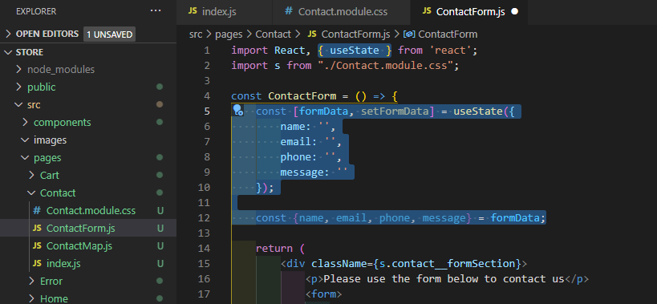
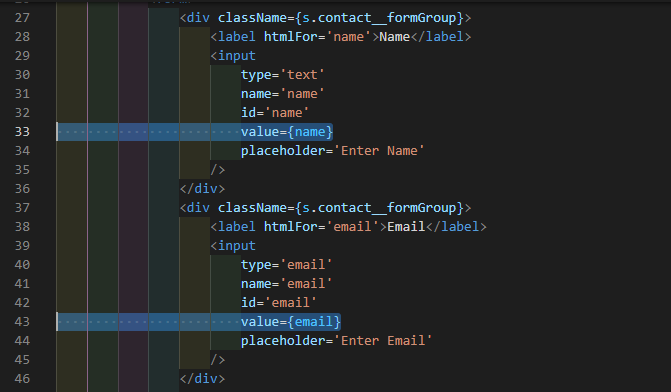
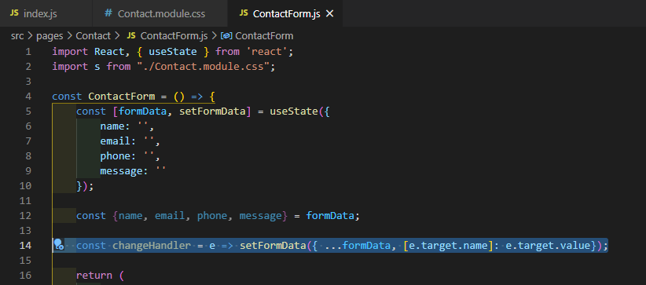
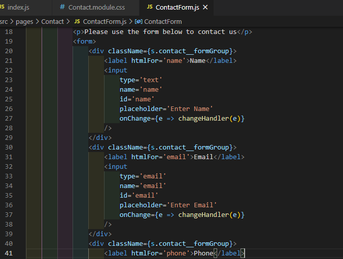
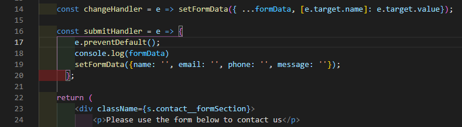
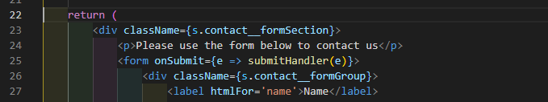

# ReactSnippet: How To
---

## Make a Contact FORM (HANDLING Events)
---
How make a contact form with a map? [Read the previous article](https://github.com/andrewsinelnikov/ReactSnippet-How-To/blob/main/task9/README.md)

### Description
Forms are usually assigned for data entry. Having received some information from the user, we want to use it. To do this, you need to add actions that will handle events made by the user or the browser.

**General way (for functional components) to add events to an element:**
> ```Javascript 
> <element onEvent={event_handler}>
> ```
where <br />
  `element` - React element, <br />
  `onEvent` - an attribute that describes the action took place (in camelCase),<br />
  `event_handler` - a function that handles user or browser action<br />

If it's needed some parameters into an event handler
> ```Javascript 
> <element onEvent={e => event_handler(e)}>
> ```

Some events <br />
| Event | Description |
|-------|-------------|
| onClick | the user clicks on an element |
| onChange | the content of a form element, or the state have changed |
| onSubmit | a form is submitted |

[List of HTML DOM Events](https://www.w3schools.com/jsref/dom_obj_event.asp)


### Step 1
Store form data in the component state with [useState hook](https://reactjs.org/docs/hooks-state.html) and set initial values
<br/>
Set the value for each element <br />
<br/>

### Step 2
Changing form data
* Add event handler function 
<br/>
* Add  the `onChange` attribute for each element that needed to be changed and set event handler for it
<br/>

### Step 3
Submiting form
* Add event handler function 
<br/>
* Add  the `onSubmit` attribute for the form and set event handler for it
<br/>

**You contact form works! 🎉**

Source files 📁 [here](https://github.com/andrewsinelnikov/ReactSnippet-How-To/tree/main/task10/src)

#### Got a question ❓   [✉️](https://twitter.com/Andrew79361148)

Want to know more? 👉 [Read next](https://github.com/andrewsinelnikov/ReactSnippet-How-To/blob/main/README.md)
