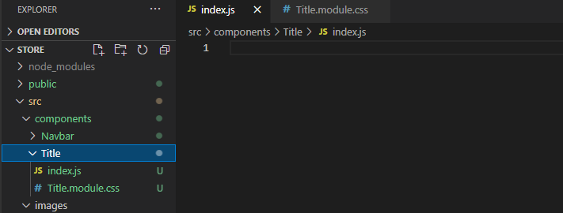
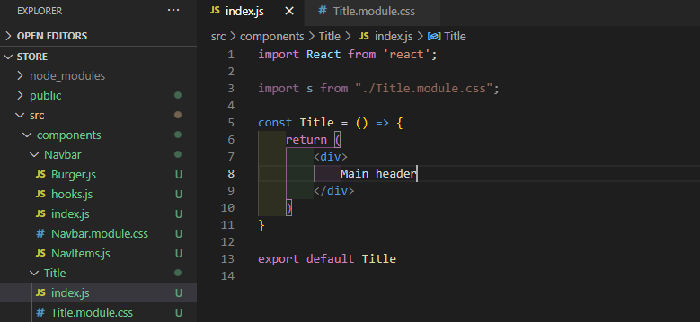

# ReactSnippet: How To
---

## Write a Function Component
---

### Description
We will write a simple functional component that displays the main header in the same style for different pages and find out key features of components

### Step 1
Add folder for your new component (we'll call it **Title**) into **components** folder and files  
(**index.js** - component file, **Title.module.css** - for its style)
 

### Step 2
Use the command **rafce** to create a function component and include a file with future styles  
> **Function component** is a Javascript function which return React element describing what should appear on the screen

 
