# ReactSnippet: How To
---

## Write a Function Component
---

### Description
We will write a simple functional component that displays the main header in the same style for different pages and find out key features of components

### Step 1
Add folder for your new component (we'll call it **Title**) into **components** folder and files  
(**index.js** - component file, **Title.module.css** - for its style)
 

### Step 2
Use the command **rafce** to create a function component and include a file with future styles  
> **Function component** is a Javascript function which return React element describing what should appear on the screen

 

### Step 3
Give html structure and style the component 
[How to style React components](https://github.com/andrewsinelnikov/ReactSnippet-How-To/edit/main/task13/README.md)  
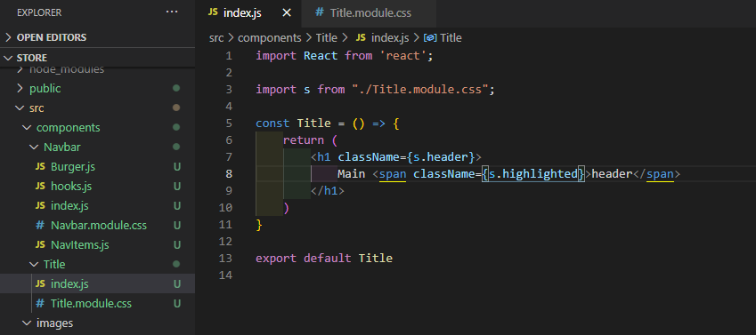 
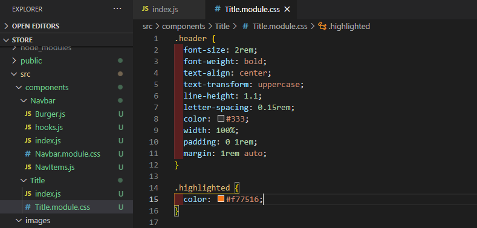 

### Step 4
Export your component into each page 
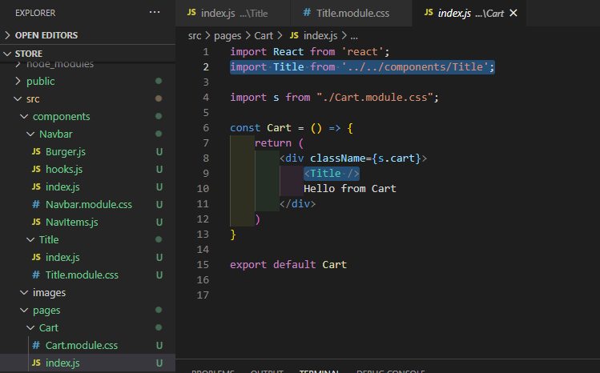 
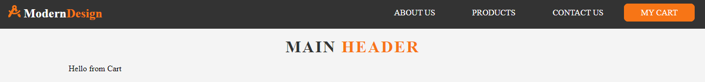 
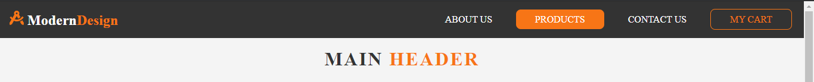 

### Step 5
Change title for each page with **props**
> **props** is an object that represents function arguments that is being used for passing data from one component to another
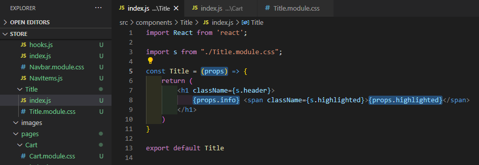 
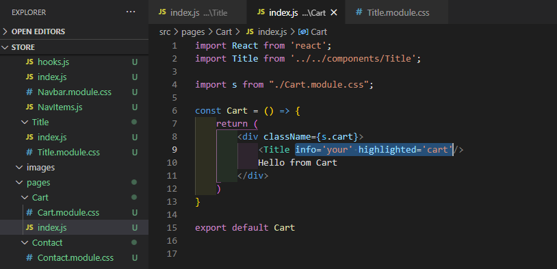 

Simplify it with destructuring
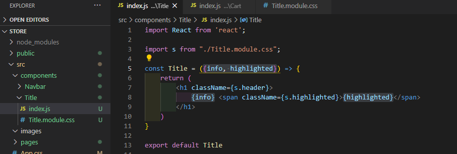 
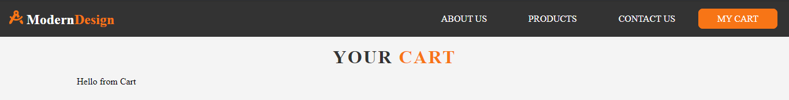 
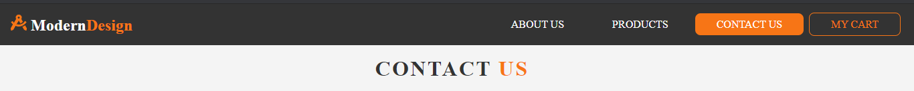 
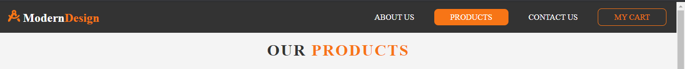 

**You component is ready! 🎉**

Source files 📁 [here](https://github.com/andrewsinelnikov/ReactSnippet-How-To/tree/main/task11/src)

#### Got a question ❓   [✉️](https://twitter.com/Andrew79361148)

Want to know more? 👉 [Read next](https://github.com/andrewsinelnikov/ReactSnippet-How-To/blob/main/README.md)
