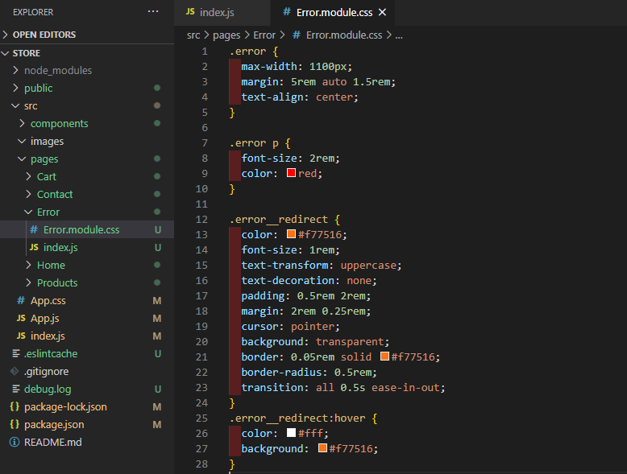

# ReactSnippet: How To
---

## Redirect Any Invalid URLs
---

### Description
We will handle wrong URL and provide a fallback component for displaying
 

### Step 1
Give html structure and style of the component 
 
 

[How we created **Title** component?](https://github.com/andrewsinelnikov/ReactSnippet-How-To/blob/main/task11/README.md)
