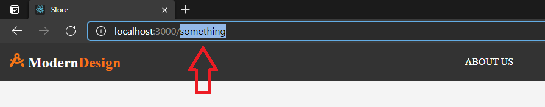

# ReactSnippet: How To
---

## Redirect Any Invalid URLs
---

### Description
We will handle wrong URL and provide a fallback component for displaying
 

### Step 1
Add folder for your new component (we'll call it **Title**) into **components** folder and files  
(**index.js** - component file, **Title.module.css** - for its style)
