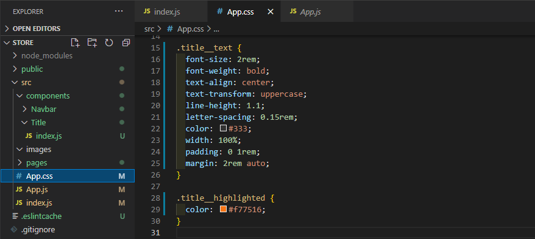
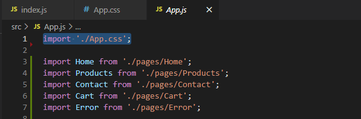
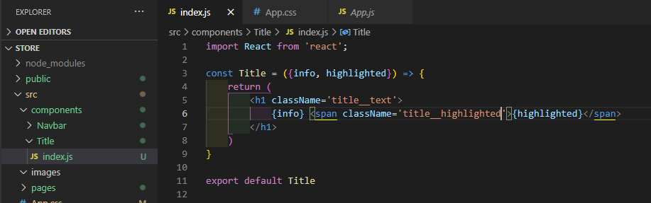
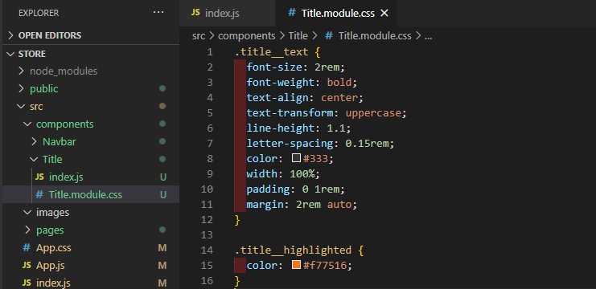
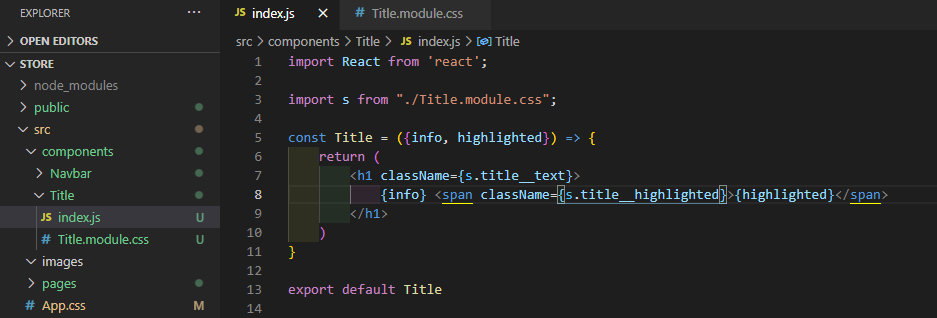
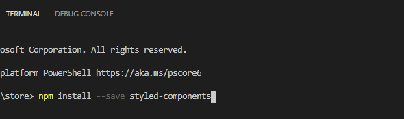

# ReactSnippet: How To
---

## Style React Components
---

### Description
We’ll consider different ways to style your React components.  
In the [previous article](https://github.com/andrewsinelnikov/ReactSnippet-How-To/edit/main/task11/README.md), we created a component **Title**. Let's stylize it

### Styling in App.css
Write all your styles here  
 
Export it into **App.js** (styles will be available for the whole application)
 
Add style to your components
 

### CSS Modules
It helps to keep styles structured  
Create CSS file with the **.module.css** extension in the same folder with your component and write all your styles there  
 
Export it into your component and use
 

### Styled-Components
Install styled-components to your application
 
