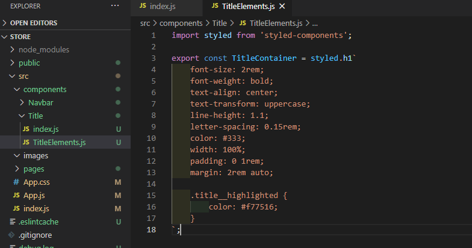
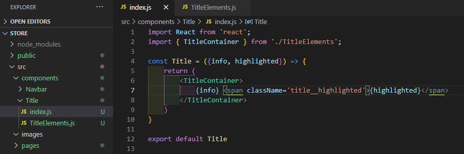

# ReactSnippet: How To
---

## Style React Components
---

### Description
We’ll consider different ways to style your React components.  
In the [previous article](https://github.com/andrewsinelnikov/ReactSnippet-How-To/edit/main/task11/README.md), we created a component **Title**. Let's stylize it

### Styling in App.css
Write all your styles here  
 
Export it into **App.js** (styles will be available for the whole application)
 
Add style to your components
 

### CSS Modules
It helps to keep styles structured  
Create CSS file with the **.module.css** extension in the same folder with your component and write all your styles there  
 
Export it into your component and use
 

### Styled-Components
Install styled-components to your application
 
Create your styled components in separate file
 
Export it into your component and use
 

**You've got it! 🎉** 
It's up to you what way to use

Source files 📁 [here](https://github.com/andrewsinelnikov/ReactSnippet-How-To/tree/main/task13/src)

#### Got a question ❓   [✉️](https://twitter.com/Andrew79361148)

Want to know more? 👉 [Read next](https://github.com/andrewsinelnikov/ReactSnippet-How-To/blob/main/README.md)
