# MERNSnippet: How To
---
## Express Setup

### Description
> [Express](http://expressjs.com/) is a flexible web framework for [Node.js](https://nodejs.org/)  

This guide will give you a good start on getting comfortable with it.

### Step 1
Set up a **package.json** for your project. 
>**package.json** - gives information that allows to identify the project as well as handle the project's dependencies

Run the next command in **Terminal** 
`npm init -y`  
where ` -y ` helps to generate it without any questions.
Change the main field there for the entry point of the program  
`"main": "server.js"` 
Set the folder structure
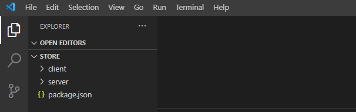 

### Step 2
Install needed dependencies for backend
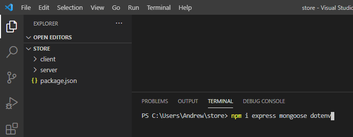 
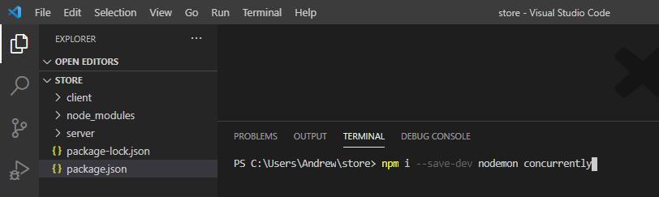 

### Step 3
Create front-ent part of the project. Run the next one in **client** folder
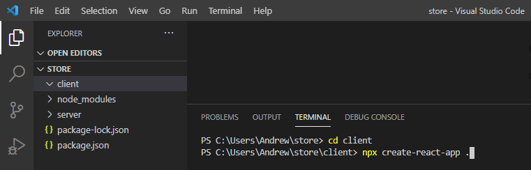 

### Step 4
Create **server.js** file in **server** folder. It will be the entry point of the project
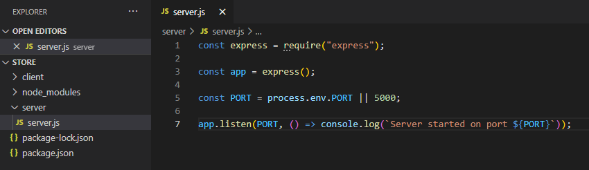 
where ` require('express') ` - includes **express** module, ` app ` - an express application object,  
`app.listen()` - the app starts a server and listens on port 5000 for connections 
Add **.env** file to the root of the project and set a port
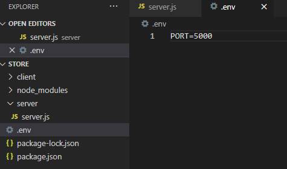 
Bring it into **server.js** and tun the server
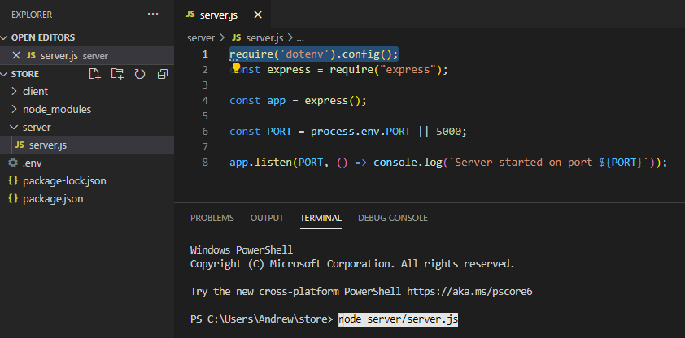 

### Step 5
Configure **Git** to ignore files you don't want to check in to **GitHub** 
Add one **.gitignore** file (for both backend and front-end) in your repository's root directory to tell Git which files and directories to ignore when you make a commit. 
Copy everything from **.gitignore** in the client side and paste in there
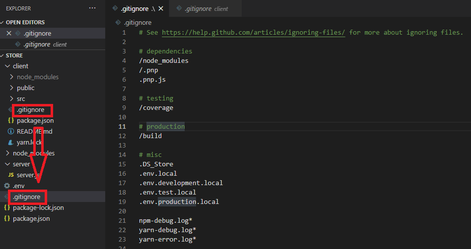 
Change it
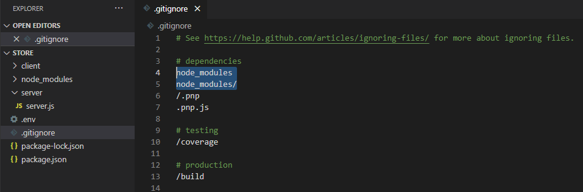 
Run the following commands to delete **.gitignore** from client side
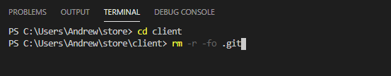 
Delete **.gitignore** from **client** directory.
Create **git** repository in the root directory
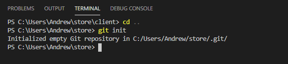 
