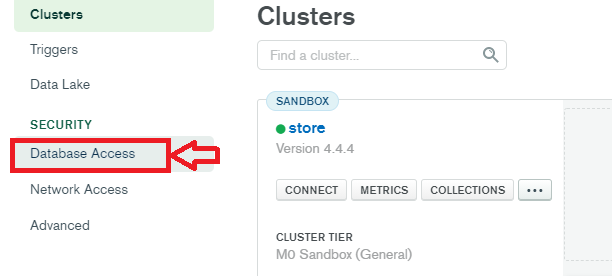

# MERNSnippet: How To
---
## Set Up MongoDB Atlas

### Description
> [MongoDB](https://www.mongodb.com/) is a document-based, distributed database for the cloud  

MongoDB Atlas helps host and manage data in the cloud

### Step 1
Sign Up MongoDB account [here](https://account.mongodb.com/account/register) 
 
or [Sign In](https://account.mongodb.com/account/login) if you already have
 

### Step 2
Create a project  
   
Name your project  
  

### Step 3
Create a cluster for the project  
  
and choose cloud provider, region 

### Step 4
Add a database user  
  
  
and set up name, password, permissions  
 
