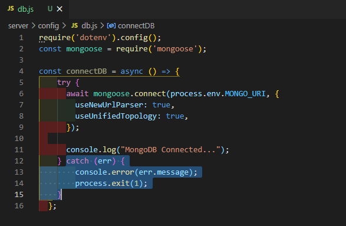
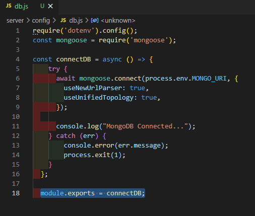
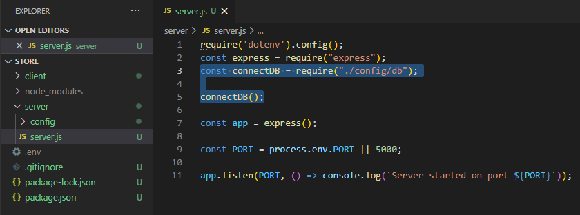
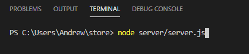
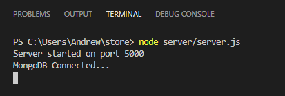

# MERNSnippet: How To
---
## Connect to MongoDB Using Mongoose

### Description
> [Mongoose](https://mongoosejs.com/) is a ODM-library (Object Data Modelling) for representation data from the code ([Node.js](https://nodejs.org/)) in [MongoDB](https://mongodb.com/)  

Here we'll learn how to connect your application with database.

### Step 1
Add **config** folder into your backend part and create **db.js** file there for connection with database  
  
  
  

### Step 2
Import mongoose library  
  

### Step 3
Bring your connection string into **.env** file (See [Set Up MongoDB Atlas](https://github.com/andrewsinelnikov/ReactSnippet-How-To/edit/main/task15/README.md) step 6) 
  
And set your password there

### Step 4
In **db.js** import **.env** 
  

### Step 5
Create a function for connection to database 
  
where `{useNewUrlParser: true, // others }` is an object with required settings

### Step 6
Add case when somethign is wrong with connection 
  

### Step 7
Export your function 
  

### Step 8
Bring into **server.js** your **connectDB** function and run it there 
  

### Step 9
Run your server 
  
Here we go
  

 
