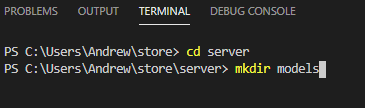

# MERNSnippet: How To
---
## Build Models

### Description
> [Models](https://mongoosejs.com/docs/models.html) are constructors for creating, reading and updating data from the underlying MongoDB database. 

This guide will teach you how to describe your data for [MongoDB](https://www.mongodb.com/) database.

### Step 1
Add **models** folder into your backend part, create **Product.js** file there 
  
  
