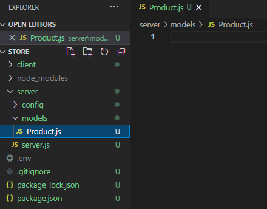
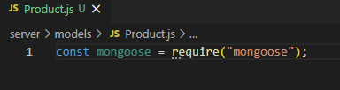
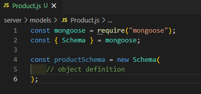
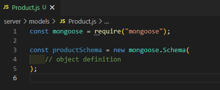

# MERNSnippet: How To
---
## Build Models

### Description
> [Models](https://mongoosejs.com/docs/models.html) are constructors for creating, reading and updating data from the underlying MongoDB database. 

This guide will teach you how to describe your data for [MongoDB](https://www.mongodb.com/) database.

### Step 1
Add **models** folder into your backend part, create **Product.js** file there 
  
  
And import **mongoose** library into **Product.js**  
  

### Step 2
Define the [Schema](https://mongoosejs.com/docs/guide.html#definition) 
> A [schema](https://mongoosejs.com/docs/guide.html#definition) is a definition of the structure of a document. It's a constructor that requires an object where each field corresponds to the name in the collection 

- There are 2 ways using **Schema**. It's up to you which one to use.  
  1. First way  
    
  2. Second way  
    
