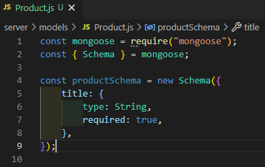

# MERNSnippet: How To
---
## Build Models

### Description
> [Models](https://mongoosejs.com/docs/models.html) are constructors for creating, reading and updating data from the underlying MongoDB database. 

This guide will teach you how to describe your data for [MongoDB](https://www.mongodb.com/) database.

### Step 1
Add **models** folder into your backend part, create **Product.js** file there 
  
  
And import **mongoose** library into **Product.js**  
  

### Step 2
Define the [Schema](https://mongoosejs.com/docs/guide.html#definition) 
> A [schema](https://mongoosejs.com/docs/guide.html#definition) is a definition of the structure of a document. It's a constructor that requires an object where each field corresponds to the name in the collection 

- There are 2 ways using **Schema**. It's up to you which one to use.  
  1. First way  
    
  2. Second way  
    
- Object definition.  
  The general form is `keyName:SchemaType`, where **keyName** is a name of the property, **SchemaType** can include a type, a default value, or other info  
    
  **SchemaType** can be one of the following values: `String`, `Number`, `Date`, `Buffer`, `Boolean`, `Mixed`, `ObjectId`, `Array`, `Decimal128`, `Map`. 
  In addition to the type property, you can specify [additional options](https://mongoosejs.com/docs/schematypes.html#schematype-options). For example,  `required`: boolean   or function, specifies a property as needed to include; 
  `default`: sets a default value for the path; 
  `minLength`: Number, requires a the minimum string length. 
  If you need some additional properties for a path then a schema type required a `type` property  
    
  Add all the required fields for your schema 
    
  By default, Mongoose adds an `_id` property to your schema to distinguish each your item. Of course, you can define your own `_id`

### Step 3
Export a Model 
  

**Congratulations! 🎉** MongoDB is waiting for your data 🏒

Source files 📁 [here](https://github.com/andrewsinelnikov/ReactSnippet-How-To/tree/main/task17/src)

#### Got a question ❓   [✉️](https://twitter.com/Andrew79361148)

Want to know more? 👉 [Read next](https://github.com/andrewsinelnikov/ReactSnippet-How-To/blob/main/README.md)
