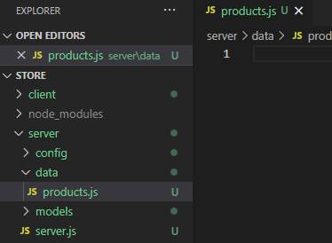

# MERNSnippet: How To
---
## Insert Data into MongoDB

### Description
> [Models](https://mongoosejs.com/docs/models.html) are constructors for creating, reading and updating data from the underlying MongoDB database. 

This guide will teach you how to fill up [MongoDB](https://www.mongodb.com/) database with data

### Step 1
Add **data** folder into your backend part, create **product.js** file there 
  
