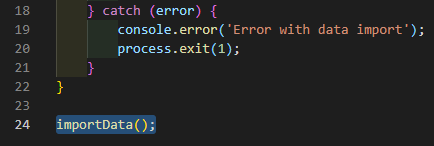
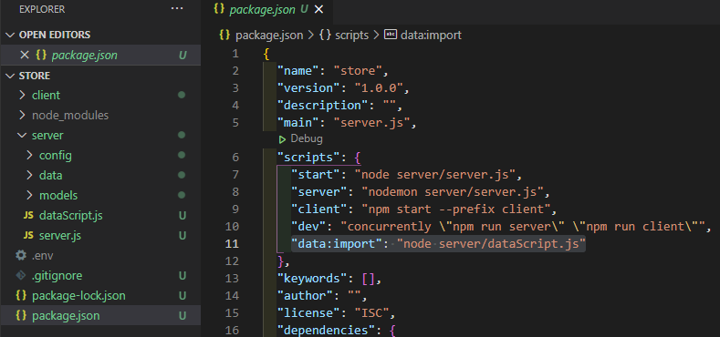
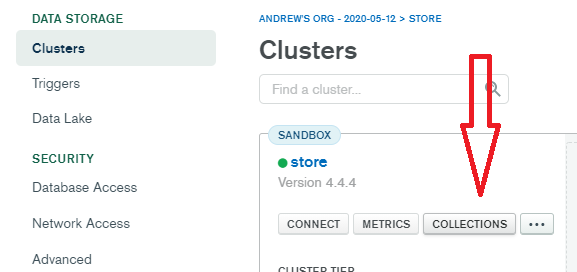
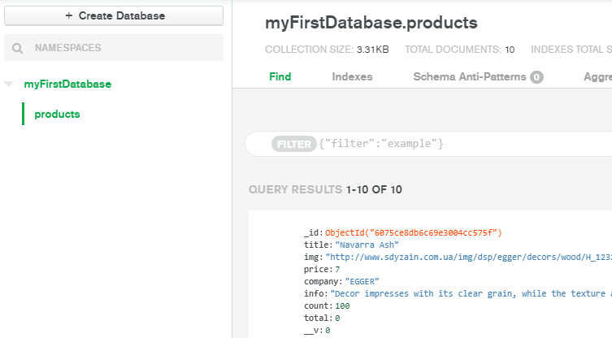

# MERNSnippet: How To
---
## Insert Data into MongoDB

### Description
This guide will teach you how to fill up [MongoDB](https://www.mongodb.com/) database with data

### Step 1
- Add **data** folder into your backend part, create **products.js** file there 
    
- Create an array of data objects  
    

### Step 2
Import your data into MongoDB 
- Add **dataScript.js** file into **server** folder. Import **.env**, **db**, **products** and **Products** files.  
    
- Connect MongoDB  
    
- Create a function to import your data. And then, first of all, run **deleteMany()** function to make sure your **Product** collection is empty  
    
- Run **insertMany()** function to insert your data into **Product** collection. And give a message if evreything went ok 
    
- Since the job is done and the Node.js event loop no longer having anywork to perform, add [`process.exit()`](https://nodejs.org/api/process.html#process_event_exit) method 
    
- Handle the situation when something went wrong. `process.exit()` means there was an uncaught exception 
    
- Run this function 
    
- Add script for this snippet into **package.json** and run it  
    
    
- Check your database collections  
    
    

**Congratulations! 🎉** Your data is in the database. They willing to work 😅

Source files 📁 [here](https://github.com/andrewsinelnikov/ReactSnippet-How-To/tree/main/task18/src)

#### Got a question ❓   [✉️](https://twitter.com/Andrew79361148)

Want to know more? 👉 [Read next](https://github.com/andrewsinelnikov/ReactSnippet-How-To/blob/main/README.md)
