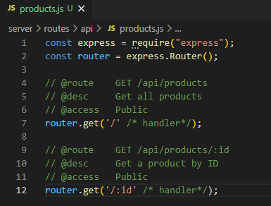
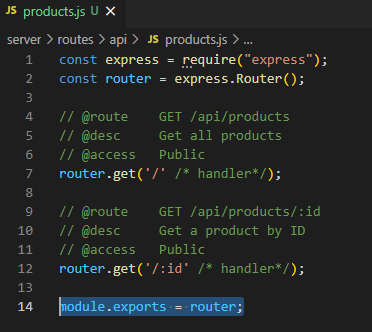
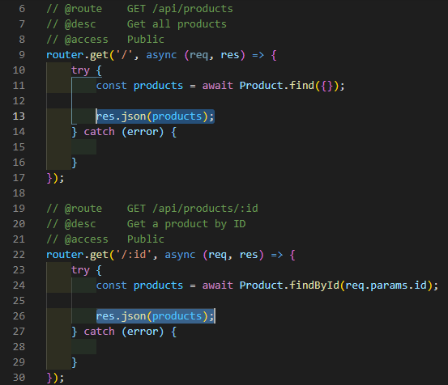
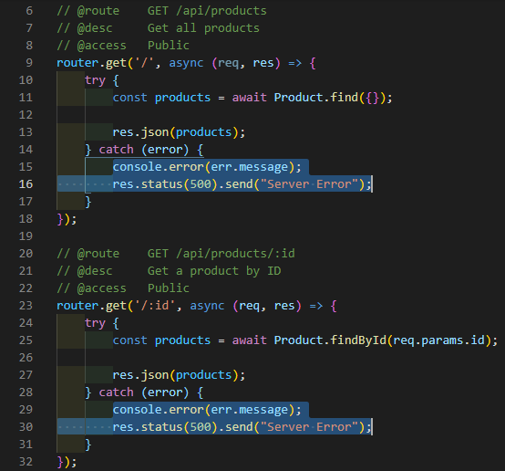
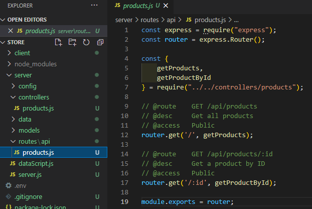
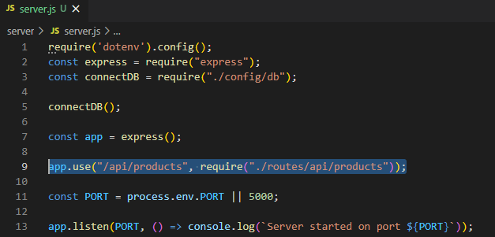

# MERNSnippet: How To
---
## Define Routes (Express)

### Description
This guide will teach you how to create routes in your App <br />
> [Route](http://expressjs.com/en/starter/basic-routing.html) is a description of the application's response to client requests <br />

### Step 1
Set a structure in your backend part. Add the `routes` folder, and in it the `api` folder and create the **products.js** file<br/>
   <br />  
### Step 2   
Import `express` and create a router object <br />
   <br />
### Step 3
Describe your route <br />
   <br />
### Step 4
Call a method on your router object. Method corresponds to an HTTP methods (GET, HEAD, POST, PUT, DELETE, TRACE, OPTIONS, CONNECT, PATCH) in lower case<br />
```JavaScript
  router.get(/*parameters*/);
```
**GET** retrieves data<br />
**POST** sends data to the server <br />
**PUT** creates or replaces data <br />
**DELETE** deletes data<br />
### Step 5
Set route path. Path is the URL requested by the client. It can be<br />
  * **strings**
    - '/' path will match requests to the root route <br />
    - '/contact' path will match requests to `/contact` <br />
  * **string patterns**. It can include: ? (there must be 0 or 1 previous character (group)), + (1 or more previous character (group)), * (may have any string), () (group)
    - '/ad+' path will match `/ad`, `/add`, `/adddddd` <br />
  * **regular expressions**
    - '/z(oo|u)m/' path will match `/zoom` or `/zum` <br />
  * **route parameters** - a portion of a URL path at the specific position  with a colon prefix <br />
    - The values are stored in the **req.params** object where names are keys (`/:id/` can be used in `req.params.id`), where the `req` object is the HTTP request.

So let's create two routes for our app. The first is for displaying all products, the second for the selected product <br />
 <br />
To use routes we need to export them <br />
 <br />
### Step 6
Create the route callback functions to handle a request. Such functions take parameters: `req` - the request object, `res` - the response object, `next` (optional) - the function in the application’s request-response cycle <br />
 <br />
To catch errors in the asynchronous code we use a `try...catch` block <br />
 <br />
Bring in [models](https://github.com/andrewsinelnikov/ReactSnippet-How-To/blob/main/task17/README.md) that are responsible for reading documents from the underlying MongoDB database <br />
 <br />
To work with data from [MongoDB](https://www.mongodb.com/) we use [Mongoose query methods](https://mongoosejs.com/docs/queries.html). <br />
* `Model.find()` finds all documents. To choose all products from database add <br />
   <br />
  To find all products of a specific company add a filter <br />
  ```JavaScript
    const products = await Product.find({ company:"EGGER" });
  ```
* `Model.findById()` finds a documents by its `_id`. To choose a specific product from database add <br />
   <br />

To send a response to the client use the response object methods <br />
`res.json()` - sends a JSON response<br />
`res.send()` - sends a response of various types<br /> 
 <br />
Handle the case when something went wrong <br />
> [Http response status code](https://developer.mozilla.org/en-US/docs/Web/HTTP/Status) indicates how the request was completed

 <br />

### Step 7 (optional)
It is considered best practice to keep the functions in a separate file. Usually these files are located in the folder. This makes the code much cleaner <br />
 <br />
 <br />

### Step 8
To use the defined routes import it in **server.js** <br />
 <br />

**Congratulations! 🎉** Your server is working with a database 👫

Source files 📁 [here](https://github.com/andrewsinelnikov/ReactSnippet-How-To/tree/main/task19/src)

#### Got a question ❓   [✉️](https://twitter.com/Andrew79361148)

Want to know more? 👉 [Read next](https://github.com/andrewsinelnikov/ReactSnippet-How-To/blob/main/README.md)
