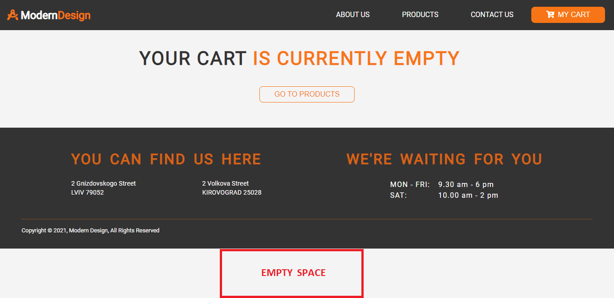

# ReactSnippet: How To

---

## Stick A Footer To Bottom Of The Webpage

---

### Description
Making a footer fixed at the bottom of the page prevents ugly broken design. Otherwise you will end up with unnecessary white space as shown below 👇



<br/>

How to get rid of this? By improving the style, you will get 👍 

<br/>

<br/>

### How to do it?

Solution is suggested with [flexbox](https://www.w3schools.com/css/css3_flexbox.asp) <br/>

#### Step 1
Make a project structure in **App.js**

```JavaScript
import React from 'react'
// your inports

const App = () => {
  return (
    <Fragment>
      <div className='content'>
        // your components
      </div>
      
      <Footer className='footer'/>
    </Fragment>
  )
}

export default App
```
Key points on this stage are 
`className='content'` for your content and
`className='footer'` for your footer

#### Step 2
Add a height in **App.css**

```CSS
html,
body {
  height: 100%;
}
```

#### Step 3
Design flexible responsive layout structure. For what element?
If you style just next 
```CSS
body {
  display: flex;
  flex-direction: column;
}
```
It doesn't work for React project <br />
If you look at `index.js`, you will see that all content is rendering in the element with `id="root"` (`index.html`). Therefore, for React project, you should style `#root`
```CSS
#root {
  height: 100%;
  display: flex;
  flex-direction: column;
}
```

#### Step 4
Fill the space for the content
```CSS
.content {
  flex: 1 0 auto;
}
```

#### Step 5
Specifies how much your footer will shrink relative to the content
```CSS
.footer {
  flex: 0 0 auto;
}
```
