# MERNSnippet: How To
---
## Define Routes (part 2)

### Description
In [the last article](https://github.com/andrewsinelnikov/ReactSnippet-How-To/tree/main/task19), we learned how to define routes, in particular how to get data. But it is also important for us to be able to add new data, update or delete it. This article will teach you how to do it  

### Step 1
ADD new data. In our project, we want to be able to add a new product. Let's create a function to manage it in **products.js** from **controllers** folder 
  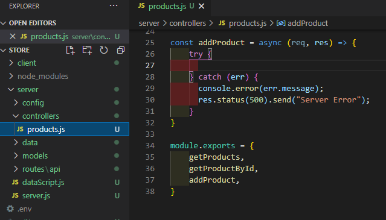    
Define our new product according to **Product model**. We can get the values of each field from the reques object `req.body` 
  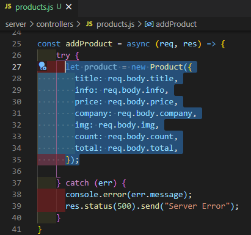    
Save your new object and send a JSON response 
  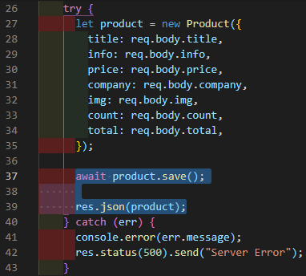   
Add a new route to **products.js** in **rouutes/api** folder. To add data we're going to use `post` method from [**Express**](http://expressjs.com/en/4x/api.html#app.post.method) 
  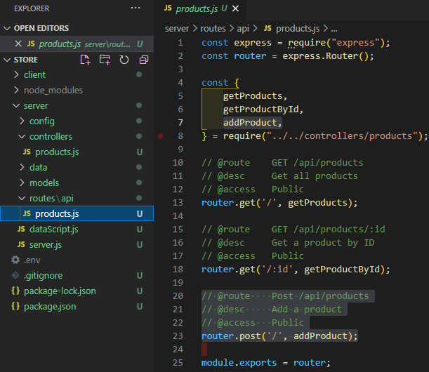   
Add [express.json()](http://expressjs.com/en/4x/api.html#express.json) to server.js  
  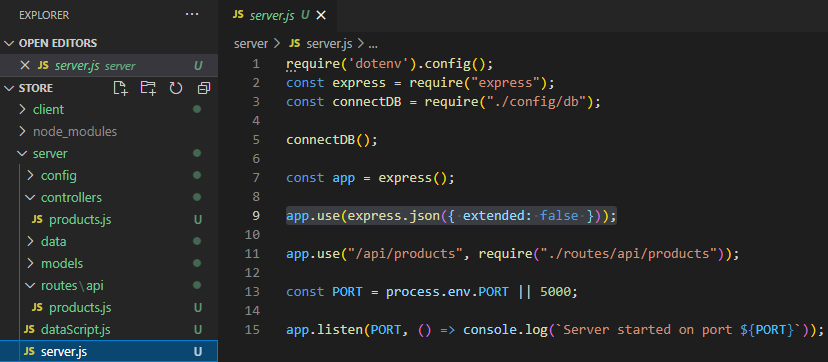   

### Step 2
UPDATE data (our product). Let's create a **updateProduct()** function in **products.js** from **controllers** folder 
  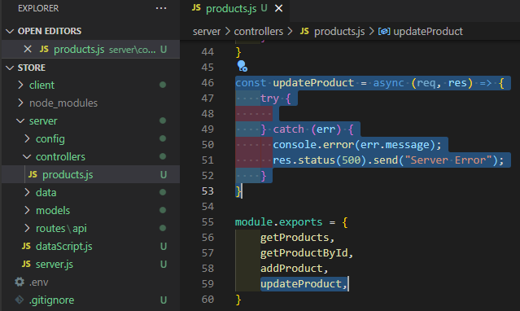    
Destructure the fields of the request object **req.body** and build an object with updated fields  
  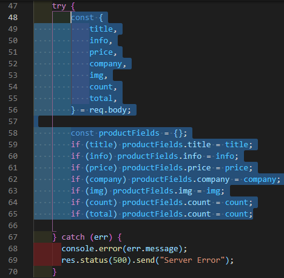    
Find a product by id. If it exists, assign new values to the fields  
  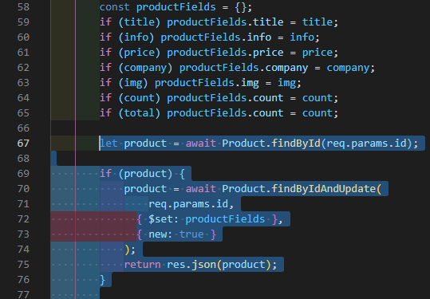    
If there is no product with id, send a message  
  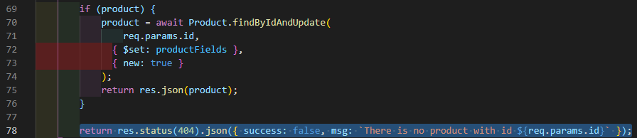  
Add a new route to **products.js** in **rouutes/api** folder. To update data we're going to use `put` method from [**Express**](http://expressjs.com/en/4x/api.html#app.put.method) 
  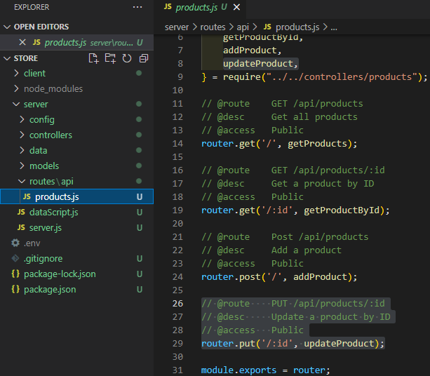   
Set **useFindAndModify** in **db.js** from **config** folder  
  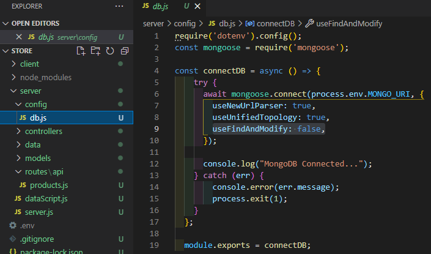   

### Step 3
DELETE data (our product). Let's create a **deleteProduct()** function in **products.js** from **controllers** folder 
  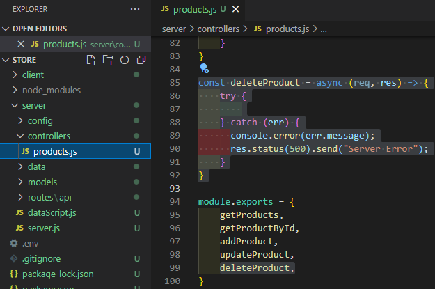    
