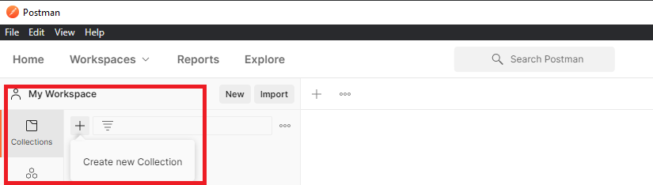
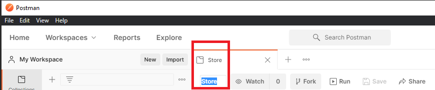
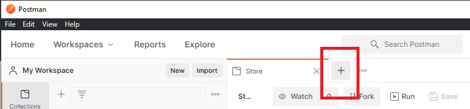

# MERNSnippet: How To
---
## Test Your API with Postman

### Description
In [the previous article](https://github.com/andrewsinelnikov/ReactSnippet-How-To/tree/main/task20), we defined routes for our app. Do they work? How to check without front-end part? [Postman](https://www.postman.com/) is a good instrument to test it out  

> Postman is a API client that helps to create, test, save HTTP/s requests and get their responses. 

### Step 1
[Downloand](https://www.postman.com/downloads/) Postman and install on your computer. You're ready to test the routes we defined (make sure you launch the server in **Terminal**, `npm run dev`) 

### Step 2
Create a collection for the project 
      
Give it a name  
      
Open a Tab for a request 
      
