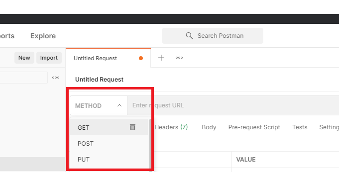
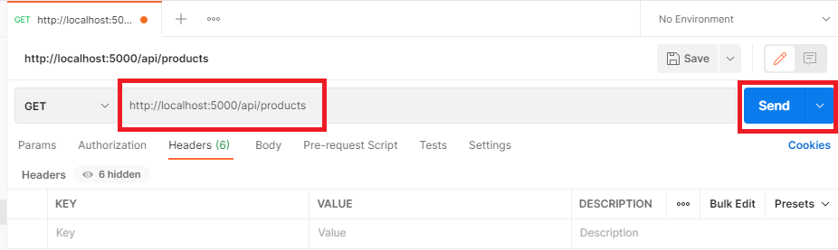
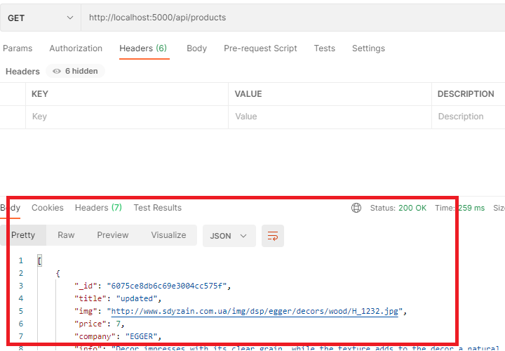
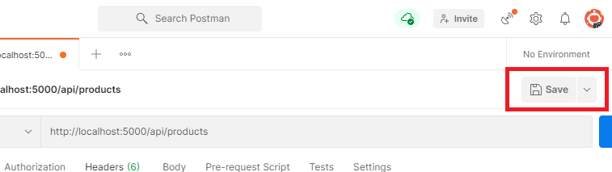
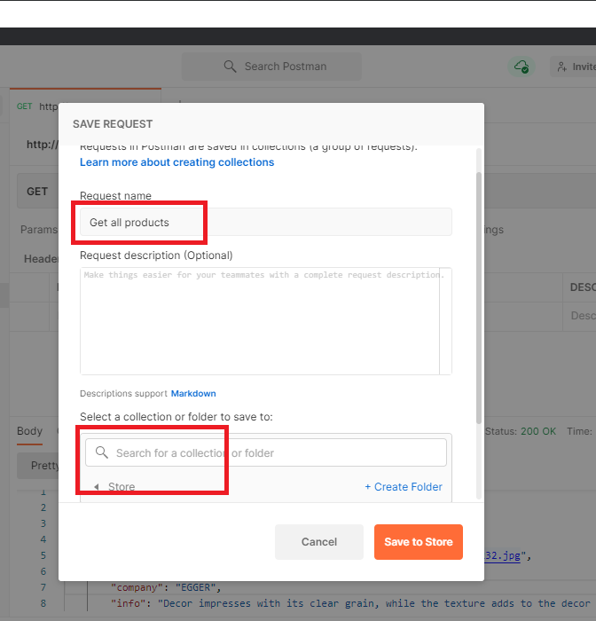
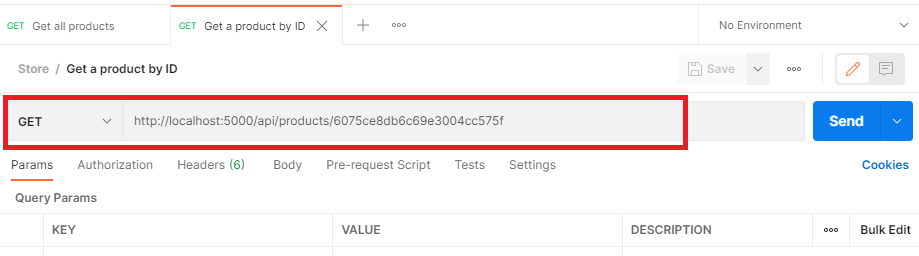
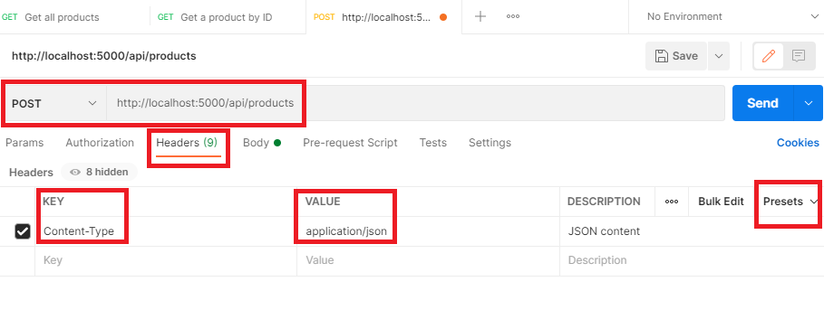
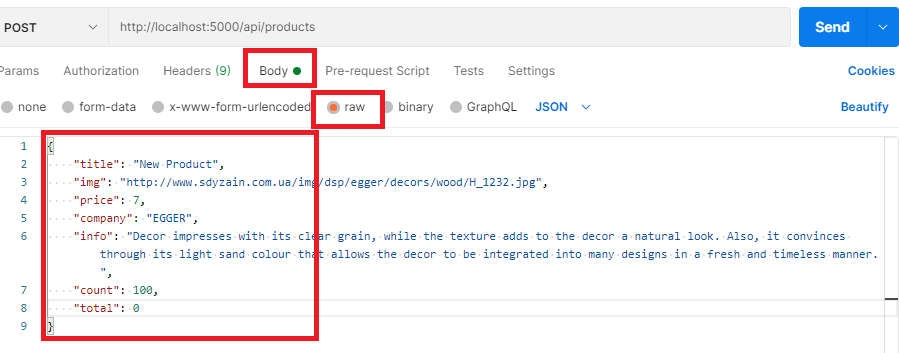

# MERNSnippet: How To
---
## Test Your API with Postman

### Description
In [the previous article](https://github.com/andrewsinelnikov/ReactSnippet-How-To/tree/main/task20), we defined routes for our app. Do they work? How to check without front-end part? [Postman](https://www.postman.com/) is a good instrument to test it out  

> Postman is a API client that helps to create, test, save HTTP/s requests and get their responses. 

### Step 1
[Downloand](https://www.postman.com/downloads/) Postman and install on your computer. You're ready to test the routes we defined (make sure you launch the server in **Terminal**, `npm run dev`) 

### Step 2
Create a collection for the project 
      
Give it a name  
      
Open a Tab for a request 
      

### Step 3
Test route *Get All Products*  
Set **GET** method  
      
Enter request URL `http://localhost:5000/api/products` and send it 
      
Look at the response. We've got all products from the database  
      
Save the request for future reference  
      
Give request name and select a collection to save to  
      

### Step 4
Test route *Get a Product by ID*  
Choose one of the products that you received in the previous request and take its `_id`.  
Open a Tab. Set **GET** method and enter request URL with `_id` `http://localhost:5000/api/products/`**your id** and send it 
      
Save the request for future reference  

### Step 5
Test route *Add a Product*  
Open a Tab. Set **POST** method, enter request URL `http://localhost:5000/api/products`. 
Open the **Headers** tab and set a **KEY** to `Content-Type`, a **VALUE** to `application/json`. Save it as a preset *JSON content* for future reference  
      
On the **Body** tab with the **raw** option, set an *Product* object with the required fields. And send a request  
      
Save the request for future reference  
