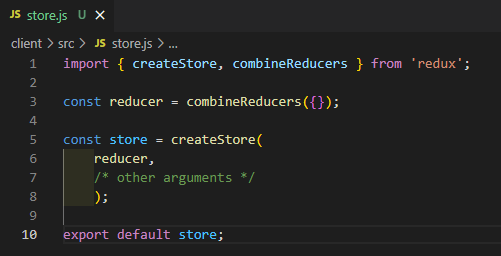
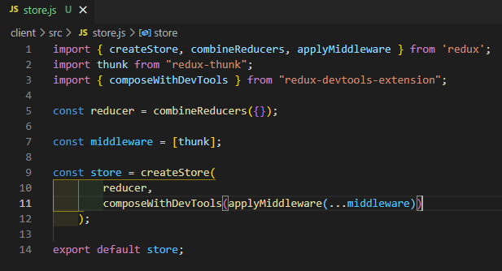
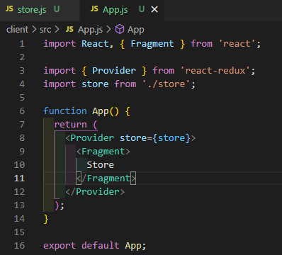

# MERNSnippet: How To
---
## Create Redux Store

> [Redux](https://redux.js.org/) is a JavaScript library for managing application state. It helps update state in predictable way across client, server, and native environments<br />

> [Redux Store](https://redux.js.org/tutorials/fundamentals/part-4-store) is an object that holds global state of a Redux application. To change the state we need to dispatch an action on it<br />

### Description
This tutorial give you a comfortable start to using Redux in your application<br /> 

### Step 1
Create a **store.js** file in **client/src** folder<br/>
   <br />  

### Step 2
- Import a **createStore** function<br/>
  ```Javascript
    import { createStore } from 'redux'
  ```
- Call it <br />
  ```Javascript
    const store = createStore(/* arguments */);
  ```
- Export your store <br />
  ```Javascript
    export default store;
  ```
   <br />  

### Step 3
Add arguments <br />
1.  `reducer` is function that returns the next state<br/>
  * Import a **combineReducers** function. It returns an object that combines different reducing functions into a single function <br />
    ```Javascript
      import { createStore, combineReducers } from 'redux'
    ```
  * Call it <br />
    ```Javascript
      const reducer = combineReducers({});
    ```
  * Pass it into **createStore()** <br />
    ```Javascript
    const store = createStore(
        reducer,
        /* other arguments */
        );
    ```
   <br />  
2. `initialState` (optional). The initial state <br />
   * ```Javascript
     const initialState = {};
     ```
   * Pass it into **createStore()** <br />
    ```Javascript
    const store = createStore(
        reducer,
        initialState,
        /* other argument */
        );
    ```

3. `enhancer` (optional) is a function that enhances the store with third-party capabilities such as middleware. Store enhancers add a layer customizing the store <br />
   * Import a **applyMiddleware** function
     ```Javascript
       import { createStore, combineReducers, applyMiddleware } from 'redux'
     ```
   * Redux **Thunk** middleware is a function lets you write async logic that interacts with the store
     ```Javascript
     import thunk from "redux-thunk";
     ```
     ```Javascript
     const middleware = [thunk];
     ```
     ```Javascript
     const store = createStore(
          reducer,
          initialState,
          applyMiddleware(...middleware)
        );
     ```
   * Add the **redux-devtools-extension** to your app. **Redux DevTools** allows to inspect and replay actions, to know when, how, where the state has changed at different times<br />
     ```Javascript
     import { composeWithDevTools } from "redux-devtools-extension";
     ```
     ```Javascript
     const store = createStore(
        rootReducer,
        initialState,
        composeWithDevTools(applyMiddleware(...middleware))
      );
     ```
   <br />  

### Step 4
Connect the application to the store. Change your **App.js** <br />
   <br />  

**Congratulations! 🎉** Your application is connected to Redux Store 🔗

Source files 📁 [here](https://github.com/andrewsinelnikov/ReactSnippet-How-To/tree/main/task22/src)

#### Got a question ❓   [✉️](https://twitter.com/Andrew79361148)

Want to know more? 👉 [Read next](https://github.com/andrewsinelnikov/ReactSnippet-How-To/blob/main/README.md)
