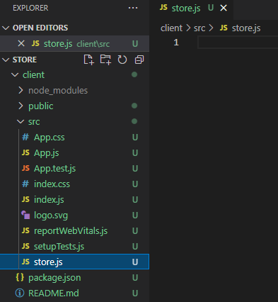
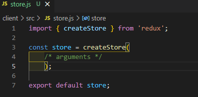

# MERNSnippet: How To
---
## Create Redux Store

> [Redux](https://redux.js.org/) is a JavaScript library for managing application state. It helps update state in predictable way across client, server, and native environments<br />

> [Redux Store](https://redux.js.org/tutorials/fundamentals/part-4-store) is an object that holds global state of a Redux application. To change the state we need to dispatch an action on it<br />

### Description
This tutorial give you a comfortable start to using Redux in your application<br /> 

### Step 1
Create a **store.js** file in **client/src** folder<br/>
   <br />  

### Step 2
- Import a **createStore** function<br/>
  ```Javascript
    import { createStore } from 'redux'
  ```
- Call it <br />
  ```Javascript
    const store = createStore(/* arguments */);
  ```
   <br />  
