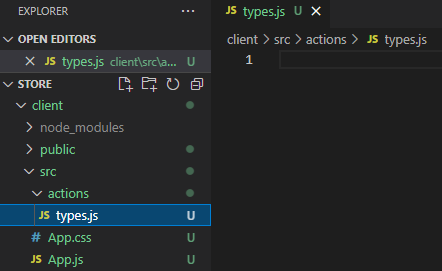
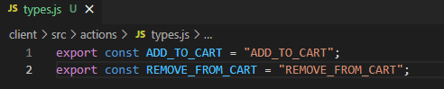
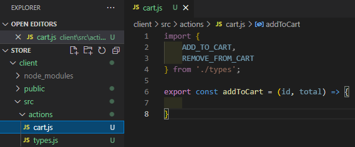
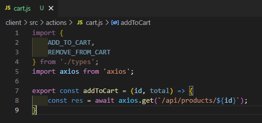

# MERNSnippet: How To
---
## Design Actions

> [**Actions**](https://redux.js.org/tutorials/fundamentals/part-2-concepts-data-flow#actions) are plain JavaScript objects that describe what happens in the application <br />

### Description
This tutorial will teach you how to design action objects <br /> 

### Step 1
Create a **actions** folder in **client/src** folder. <br /> 
Each action has a `type` field. It's a string that describes the action. For convenience, create a file **types.js** where we will place type constants for all our actions<br/>
   <br />  
Add some constants for our cart <br>  
   <br />  
An action object can have a field `payload` that contains additional data for the event.<br />
For example, if we want to add a product to the cart, then we need to pass information about this product as the value of the `payload` field (Read [Build Models](https://github.com/andrewsinelnikov/ReactSnippet-How-To/blob/main/task17/README.md)). <br />
Thus, our action may take the form <br />
  ```Javascript
    {
      type: ADD_TO_CART,
      payload: { product, title, info, price, company, img, count, total }
    }
  ```

### Step 2
Create an **cart.js** file in **actions** folder. <br />
Import type constants <br />
Define a function to dispatch the action, where `id` is the product identifier, `total` is the quantity
   <br />  
Since product data is stored on the server, we need to communicate through the HTTP protocol. One way is to use [**Axios**](https://axios-http.com/docs/intro). Axios is a JS library based on Promise for making HTTP requests from node.js or XMLHttpRequests from the browser.<br />
Import the library and make a request to get the data <br />
   <br />  

  ```Javascript
    import { createStore } from 'redux'
  ```
