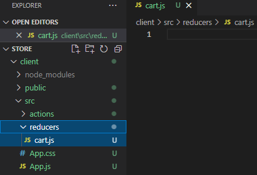
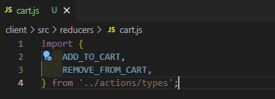
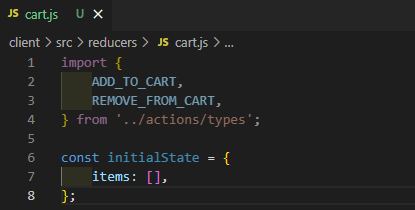
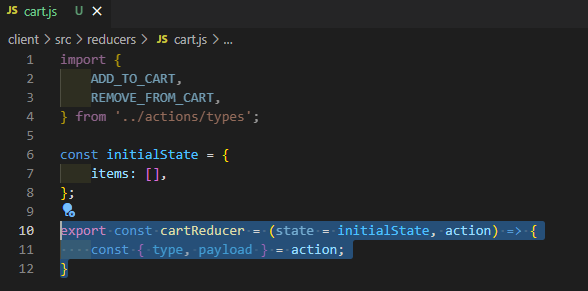
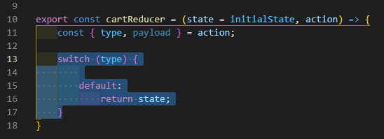
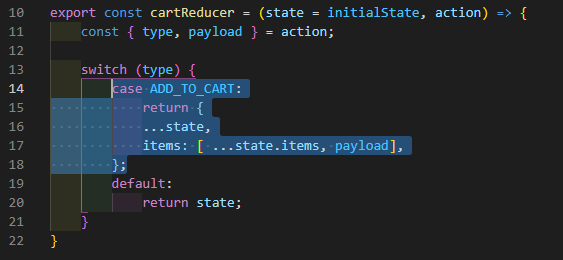
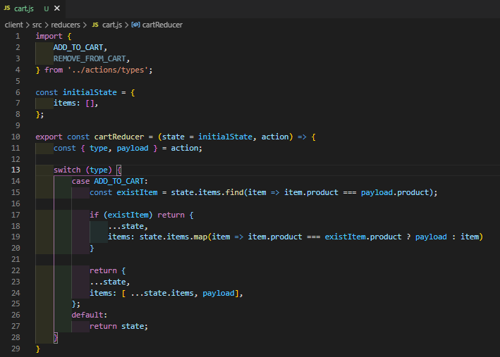
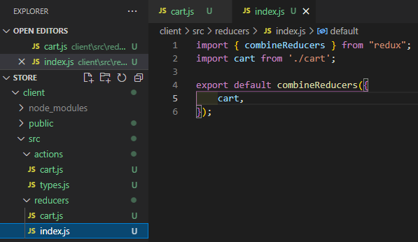
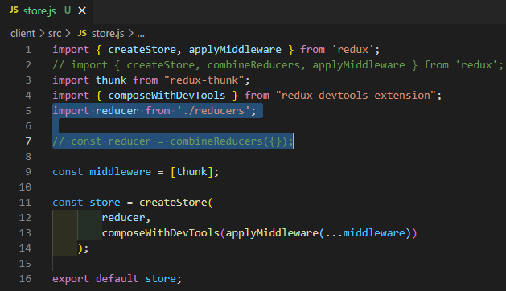

# MERNSnippet: How To
---
## Write Reducers

> [**Reducer**](https://redux.js.org/tutorials/fundamentals/part-3-state-actions-reducers#writing-reducers) is a function that returns a new state based on the current `state` and [`action`](https://github.com/andrewsinelnikov/MERNSnippet-How-To/blob/main/task23/README.md) arguments<br />

### Description
An app should has only one reducer function. That root reducer we pass to the [`store`](https://github.com/andrewsinelnikov/MERNSnippet-How-To/blob/main/task22/README.md).<br /> 
This tutorial will teach you how to define reducer <br /> 
https://developer.mozilla.org/en-US/docs/Web/JavaScript/Reference/Operators/Spread_syntax <br />
### Step 1
Create a **reducers** folder in **client/src** folder and a **cart.js** out there<br /> 
   <br />

### Step 2
Import type constants of your actions<br /> 
   <br />

### Step 3
Set the initial state (since the cart initially contains no items, its value will be an empty array)<br /> 
   <br />

### Step 4
Add a function that takes the current state and an action as arguments And for convenience, do destructuring of the action object<br /> 
   <br />

### Step 5
Since reducers update the state based on the received action (event) type we will use `switch` operator  to handle cases of each type. If the reducer does not handle a specific action, then return the state unchanged<br /> 
   <br />

### Step 6
Handle the 'ADD_TO_CART' action where we need to update the state by adding a new item to the cart.<br /> 
According to internal rules, we cannot update the existing state.  Instead, we must copy it and make changes to the copied values. In order to do this we use [**spread (...)**](https://developer.mozilla.org/en-US/docs/Web/JavaScript/Reference/Operators/Spread_syntax) operator. <br />
The item will be added to the cart as a  value of **payload** (remember, when we [dispatched the action](https://github.com/andrewsinelnikov/MERNSnippet-How-To/blob/main/task23/README.md#step-2), in the **payload** we've passed a product object) <br />
   <br />
  
Check if the item exists in the cart. First, look for this product <br />
```Javascript
  const existItem = state.items.find(item => item.product === payload.product);
```
Then mutate a copy of the state <br />
```Javascript
  if (existItem) return {
      ...state,
      items: state.items.map(item => item.product === existItem.product ? payload : item)
  }
```
Our **cartReducer** function is ready <br />
   <br />

### Step 7
Usually Redux reducers are split apart based on the section of the state that they update. Yet an app should has only one reducer function. Therefore combine all reducers you've created. Add **index.js** into **reducers** folder where you can combine all Redux reducers that you will create <br /> 
   <br />

### Step 8
Update the [**store**](https://github.com/andrewsinelnikov/MERNSnippet-How-To/blob/main/task22/README.md) <br /> 
   <br />

**Congratulations! 🎉** You have the reducer ⚙️ <br />
**TASK for you:** handle action with type: REMOVE_FROM_CART

Source files 📁 [here](https://github.com/andrewsinelnikov/ReactSnippet-How-To/tree/main/task24/src)

#### Got a question ❓   [✉️](https://twitter.com/Andrew79361148)

Want to know more? 👉 [Read next](https://github.com/andrewsinelnikov/ReactSnippet-How-To/blob/main/README.md)
