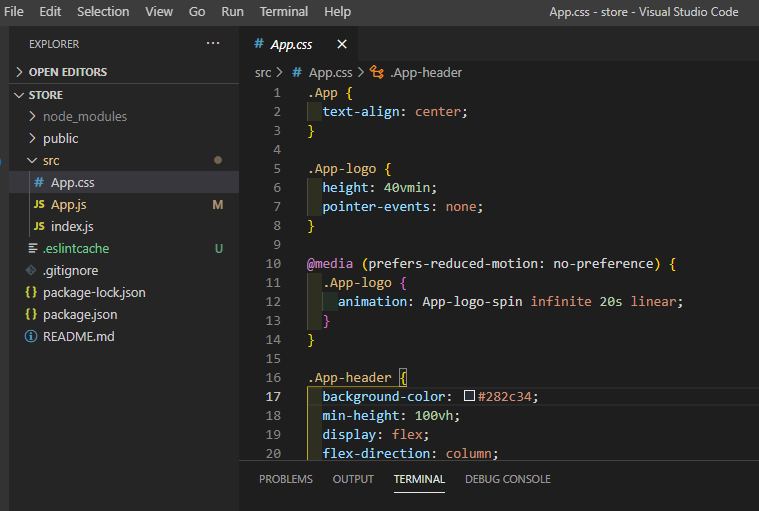

# ReactSnippet: How To

---

## Create Your Own FIRST React App

---

### Description
Creating a React application. Basic structure. 
It's not as difficult as it might seem. Just follow these steps 🏃‍♂️


#### Step 1
We will use [Create React App](https://github.com/facebook/create-react-app). In order to use it make sure you have [`Node`](https://nodejs.org/en/) and [`npm`](https://docs.npmjs.com/downloading-and-installing-node-js-and-npm) on your machine. To check it:
* Open **Command Prompt (Terminal)** (press `Windows+R` and type `cmd`)
* Type and run `node -v`
* Type and run `npm -v`
<br/>

#### Step 2
To edit the code, download [Visual Studio Code](https://code.visualstudio.com/download). And you're ready to start 💯

#### Step 3
Create your project and give it a name by running the command `npx create-react-app store` where `store` is the name (you can give the name as you need).
It may take a few minutes
<br/>

#### Step 4
Navigate to your project
<br/>
And install the dependencies needed for your project, for example, `react-router-dom` ( a tool that allows you to handle routes in a web app)
<br/>

#### Step 5
Open your project in Visual Studio Code (we've installed on step 2) by running `code .`
<br/>

Open Terminal in VSCode **(Terminal -> New Terminal** or **Ctrl+Shift+\`)** and start the development server there by running `npm start`
<br/>

Now your project looks like in the browser
<br/>

You're ready to code

#### Step 6
Clear out what you don't need from Create React App
  1. Delete highlighted files in VSCode Explorer <br />
  <br/>
  2. Edit **App.js** (delete old code and add new one) <br />
  <br/>
  <br/>
  3. Edit **App.css**. Remove all previous code <br/>
  <br/>
    And add your initial one
```CSS
* {
  box-sizing: border-box;
  margin: 0;
  padding: 0;
}
```
  4. Edit **index.js**. Remove highlighted lines
  <br/>

  5. Delete the following files in **public** folder <br/>
  <br/>
  
  6. Edit **index.html**. Remove lines and initial comments `<!-- comments -->`
  <br/>
  Change title of your project
```HTML
<title>Store</title>
```
