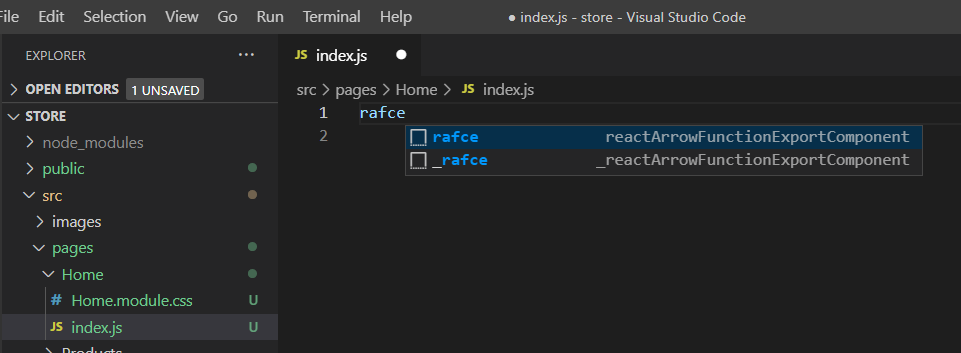
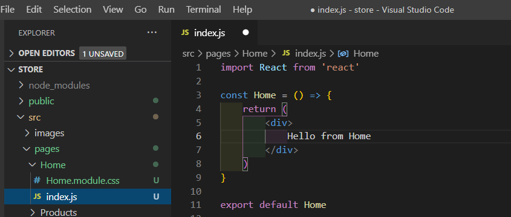
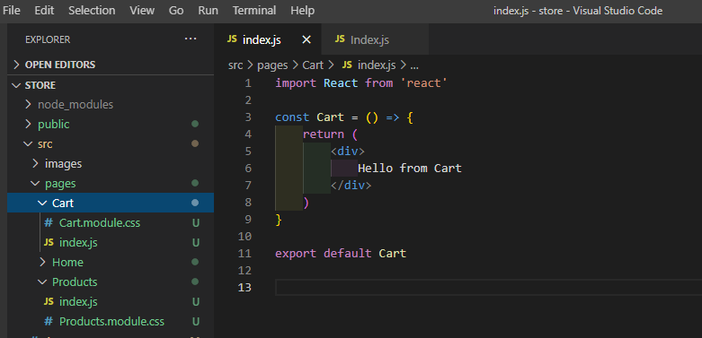

# ReactSnippet: How To

---

## Create Your Own FIRST React App

---

### Description
Creating a React application. Basic structure. 
It's not as difficult as it might seem. Just follow these steps 🏃‍♂️


#### Step 1
We will use [Create React App](https://github.com/facebook/create-react-app). In order to use it make sure you have [`Node`](https://nodejs.org/en/) and [`npm`](https://docs.npmjs.com/downloading-and-installing-node-js-and-npm) on your machine. To check it:
* Open **Command Prompt (Terminal)** (press `Windows+R` and type `cmd`)
* Type and run `node -v`
* Type and run `npm -v`
<br/>

#### Step 2
To edit the code, download [Visual Studio Code](https://code.visualstudio.com/download). And you're ready to start 💯

#### Step 3
Create your project and give it a name by running the command `npx create-react-app store` where `store` is the name (you can give the name as you need).
It may take a few minutes
<br/>

#### Step 4
Navigate to your project
<br/>
And install the dependencies needed for your project, for example, `react-router-dom` ( a tool that allows you to handle routes in a web app)
<br/>

#### Step 5
Open your project in Visual Studio Code (we've installed on step 2) by running `code .`
<br/>

Open Terminal in VS Code **(Terminal -> New Terminal** or **Ctrl+Shift+\`)** and start the development server there by running `npm start`
<br/>

Now your project looks like in the browser
<br/>

You're ready to code

#### Step 6
Clear out what you don't need from Create React App
  1. Delete highlighted files in VSCode Explorer <br />
  <br/>
  2. Edit **App.js** (delete old code and add new one) <br />
  <br/>
  <br/>
  3. Edit **App.css**. Remove all previous code <br/>
  <br/>
    And add your initial one
```CSS
* {
  box-sizing: border-box;
  margin: 0;
  padding: 0;
}
```
  4. Edit **index.js**. Remove highlighted lines
  <br/>

  5. Delete the following files in **public** folder <br/>
  <br/>
  
  6. Edit **index.html**. Remove lines and initial comments `<!-- comments -->`
  <br/>
  Change title of your project
```HTML
<title>Store</title>
```
  <br/>

#### Step 7
If you're going to deploy your project to Netlify then add [`_redirects`](https://docs.netlify.com/routing/redirects/) file to the publish directory for fixing an issue with [React Router on Netlify](https://sung.codes/blog/2018/12/18/page-not-found-on-netlify-with-react-router/)
<br/>

#### Step 8
Add a folder for your images <br />
<br/>

#### Step 9
Create pages that you will use throughout the project
  1. Add **ES7 React** snippets from **Extensions** tab (`Ctrl+Shift+X`)
  <br/>
  2. Add **pages** folder for your pages <br />
  <br/>
  3. Add components. If you're going to use **module.css** files for style then follow next structure
      * Add folder for your conponent <br />
      <br/>
      * Create files **index.js** for your component and **Name.module.css** (add name of your component instead of **Name**) for styling <br />
      <br/>
      * Type `rafce` in **index.js** (a quick way to create a component using the extension we installed) <br />
      <br/>
      * Change the name of your component and type something to indentify this component <br />
      <br/>
      * In the same way add the rest of the components you need <br />
      <br/>
  4. Import your pages into **App.js**
  <br/>    

#### Step 10
Navigation between App pages
  1. Install **[React Router Dom](https://reactrouter.com/web/guides/quick-start)** (see Step 4)
  2. Import `BrowserRouter` into **index.js**
  <br/> 
  3. Add `Route` for each component in **App.js**
  <br/> 
  4. Since each `Route` has `path='/'` it will render **Home** component for each page. If you want to avoid it then add parameter **exact**
  <br/> 
  5. To switch pages add `Switch`
  <br/> 
  6. To fix a situation where the address is entered in the Browser does not match any of the pages, create a component **Error**
  <br/> 
  7. Add `Route` for **Error** component
  <br/> 
  
View your pages in the browser
<br/> 
  
### Your boilerplate is ready for React development 🚀

#### Got a question ❓   [✉️](https://twitter.com/Andrew79361148)

Want to know more? 👉 [Read next](https://github.com/andrewsinelnikov/ReactSnippet-How-To/blob/main/README.md)
