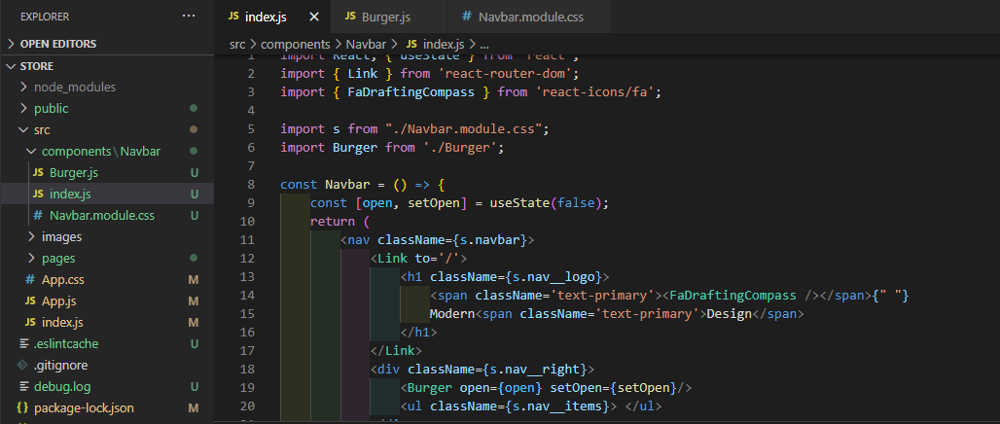
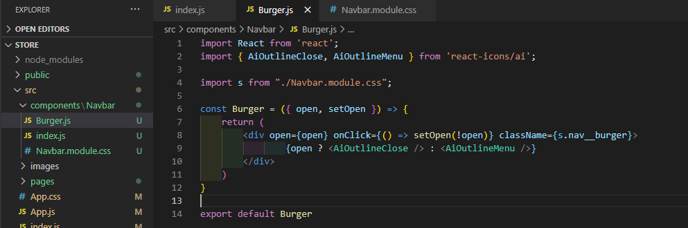
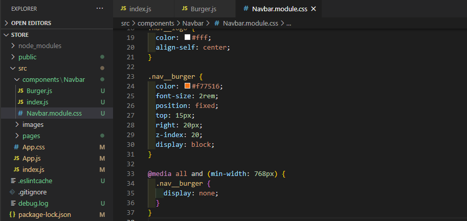
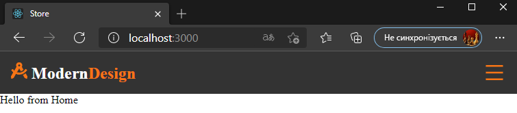

# ReactSnippet: How To

---

## Build A Responsive NAVBAR in React

---

### Description
Building a navigation bar that displays all your links in one horizontal row on larger screens or vertically on smaller screens.
We're going to create the following navbar
* for large screen
  <br/>
* for small screen<br/>
  <br/>
  <br/>


### Step 1
Create **components** folder in **src** folder for your components. If you're going to use **module.css** files for styling then add **Navbar** folder in **components** and create **index.js** and **Navbar.module.css** files there
<br/>

### Step 2
* Type `rafce` in **index.js** for creating your component and change default code
<br/>
* Import **Navbar** into **App.js**. We place it on top of the `Switch` in order to display it for each page
<br/>

### Step 3
Give a structure for navbar in **index.js**
<br/>
<br/>
And style it in **Navbar.module.css**
<br/>

### Step 4
Working on **'nav__logo'** part
* Replace `div` element on `h1` and add company name in **index.js**
```HTML
<h1 className={s.nav__logo}>
  Modern <span className='text-primary'>Design</span>
</h1>
```
Style it in **Navbar.module.css**
```CSS
.nav__logo {
  color: #fff;
  align-self: center;
}
```
Add `text-primary` class into **App.css** to highlight some parts
```CSS
.text-primary {
  color: #f77516;
}
```
* Add some icon from **[react-icons](https://react-icons.github.io/react-icons)**<br/>
Make sure you installed it (look at **package.json** file)
<br/>
Add icon you chose into **index.js**
```Javascript
import { FaDraftingCompass } from 'react-icons/fa';

// your code

<h1 className={s.nav__logo}>
  <span className='text-primary'><FaDraftingCompass /></span>{" "}
  Modern <span className='text-primary'>Design</span>
</h1>
````
* Add a link for this item with **[react-router-dom](https://reactrouter.com/web/guides/quick-start)** (make sure you installed it)
```Javascript
import { Link } from 'react-router-dom';

// your code
<Link to='/'>
  <h1 className={s.nav__logo}>
    <span className='text-primary'><FaDraftingCompass /></span>{" "}
    Modern <span className='text-primary'>Design</span>
  </h1>
</Link>
````
<br/>
<br/>
<br/>

### Step 5
Working on **'nav__burger'** part
* We will create separate component for this part - **Burger.js** in **Navbar** folder
````Javascript
import React from 'react';

import s from "./Navbar.module.css";

const Burger = () => {
    return (
        <div className={s.nav__burger}>
             Burger
        </div>
    )
}

export default Burger
````

* Add some icons for your *burger* when it is open and closed
```Javascript
import React from 'react';
import { AiOutlineClose, AiOutlineMenu } from 'react-icons/ai';

// then
  return (
        <div className={s.nav__burger}>
             <AiOutlineClose />
             <AiOutlineMenu />
        </div>
    )
}

export default Burger
````

* Import **Burger** component into **Navbar** component
```Javascript
import React, { useState } from 'react';
import { Link } from 'react-router-dom';
import { FaDraftingCompass } from 'react-icons/fa';
import Burger from './Burger';

import s from "./Navbar.module.css";

//then

            <div className={s.nav__right}>
                <Burger />
                <ul className={s.nav__items}> </ul>
            </div>
        </nav>
    )
}
export default Navbar
````

* Style **Burger** component with `.nav__burger` class in **Navbar.module.css**
````CSS
.nav__burger {
  color: #f77516;
  font-size: 2rem;
  position: fixed;
  top: 15px;
  right: 20px;
  z-index: 20;
  display: block;
}
````

* In order to display **Burger** just for small screens (for example, maximum width 768px), add **media query** to describe it
````CSS
@media all and (min-width: 768px) {
  .nav__burger {
    display: none;
  }
}
````

* To open / close the menu when clicking, you need to add some state that will handle it
  * Add **state** for **Navbar** where `open` with initial value `false`, that means menu is closed (for this purpose use [`useState`](https://reactjs.org/docs/hooks-state.html) hook). Pass it into **Burger** component
  * Add `open, setOpen` as props into **Burger** (*Burger.js*). Depending on `open` value, the menu will be closed or opened. `open` value will be changed when you click on *burger* icon

````Javascript
import React, { useState } from 'react';

// then

const Navbar = () => {
    const [open, setOpen] = useState(false);

// then
                <Burger open={open} setOpen={setOpen}/>
````

and **Burger.js**
````Javascript
// your imports

const Burger = ({ open, setOpen }) => {
    return (
        <div open={open} onClick={() => setOpen(!open)} className={s.nav__burger}>
                {open ? <AiOutlineClose /> : <AiOutlineMenu />}
        </div>
    )
}

export default Burger
````

<br/>
<br/>
<br/>

And we've got
<br/>

### Step 6
Working on **'nav__items'** part
* Let's create it also as separate component -  **NavItems.js** in **Navbar** folder
````Javascript
import React from 'react';

import s from "./Navbar.module.css";

const NavItems = () => {
    return (
        <div>
            Items
        </div>
    )
}

export default NavItems
````

* Import **NavItems.js** into **Navbar.js**
````Javascript
//your imports

import NavItems from './NavItems';

// then

            <div className={s.nav__right}>
                <Burger open={open} setOpen={setOpen}/>
                <NavItems />
            </div>

// other code
````

* Add items for our **NavItems** as a list
````Javascript
// your imports

const NavItems = () => {
    return (
        <ul>
          <li>
              products
          </li>
          <li>
              my cart
          </li>
        </ul>
    )
}

export default NavItems
````

* Set a link for each items and add classes for styling
````Javascript
import React from 'react';
import { Link } from 'react-router-dom';

import s from "./Navbar.module.css";

const NavItems = () => {
    return (
        <ul className={s.nav__list}>
          <li>
            <Link to='/products' className={s.nav__link}>
              products
            </Link>
          </li>
          <li>
            <Link to='/cart'  className={s.nav__link}>
              my cart
            </Link>
          </li>
        </ul>
    )
}

export default NavItems
````

* Style your list of items in **Navbar.module.css** with `.nav__list` class
````CSS
.nav__list {
  display: flex;
  flex-flow: row nowrap;
  align-items: center;
  list-style: none;
}

.nav__list a {
  text-decoration: none;
}
````

* Style your links with `.nav__link` class
````CSS
.nav__link {
  color: #fff;
  font-size: 1rem;
  text-transform: uppercase;
  padding: 0.5rem 2rem;
  margin: 0 0.25rem;
  cursor: pointer;
}

.nav__link:hover {
  background: #f77516;
  border-radius: 0.5rem;
}
````

* We want a different style for `cart` items. Therefore change its class on `.nav__cart` and style it
````Javascript
//code before

          <li>
            <Link to='/cart'  className={s.nav__cart}>
              my cart
            </Link>
          </li>

//code after
````

````CSS
.nav__cart {
  color: #f77516;
  font-size: 1rem;
  text-transform: uppercase;
  padding: 0.5rem 2rem;
  margin: 0 0.25rem;
  cursor: pointer;
  background: transparent;
  border: 0.05rem solid #f77516;
  border-radius: 0.5rem;
  transition: all 0.5s ease-in-out;
}

.nav__cart:hover {
  color: #fff;
  background: #f77516;
}
````

* Style our menu for small screen. In order to do this we will add **media query** for the list when menu is closed
````CSS
@media all and (max-width: 767px) {
  .nav__list {
    flex-flow: column nowrap;
    background: #333;
    position: fixed;
    top: 62px;
    right: -100%;
    height: 100vh;
    width: 20rem;
    padding-top: 3.5rem;
    opacity: 0;
    transition: all 0.5s ease-in-out;
  }

  li {
    padding: 1.125rem 0.625rem;
  }
}
````

* To display menu when it is opened we add class `.nav__active`
  * First, place it where we described `.nav__list`
  ````CSS
  .nav__list,
  .nav__active {
    display: flex;
    flex-flow: row nowrap;
    align-items: center;
    list-style: none;
  }

  .nav__list a,
  .nav__active a {
    text-decoration: none;
  }
  ````
  * Style it for small screen
  ````CSS
  @media all and (max-width: 767px) {
    .nav__list,
    .nav__active {
      flex-flow: column nowrap;
      background: #333;
      position: fixed;
      top: 62px;
      right: -100%;
      height: 100vh;
      width: 20rem;
      padding-top: 3.5rem;
      opacity: 0;
      transition: all 0.5s ease-in-out;
    }

    .nav__active {
      right: 0;
      opacity: 1;
      transition: all 0.5s ease-in-out;
      z-index: 1;
      align-content: center;
    }

    li {
      padding: 1.125rem 0.625rem;
    }
  }
  ````
  
* To open / close the menu when clicking, we will use **state** as we did to handle *burger* icon
  * Pass **state** value into **NavItems** component in **Navbar**
  ````Javascript
  //code before

          <NavItems  open={open} setOpen={setOpen}/>

  //code after
  ````

  * Get state as props in **NavItems**
  ````Javascript
  //code before

  const NavItems = ({ open, setOpen }) => {

  //code after
  ````

  * Depending on **state** value, assign a class for the list of menu items (`.nav__list` or `nav__active`) 
  ````Javascript
  //code before

  const NavItems = ({ open, setOpen }) => {
    let close = s.nav__list;
    let active = s.nav__active;
    
    return (
        <ul className={open ? active : close}>

  //code after
  ````
