# ReactSnippet: How To

---

## Build A Responsive NAVBAR in React

---

### Description
Building a navigation bar that displays all your links in one horizontal row on larger screens or vertically on smaller screens.
We're going to create the following navbar
* for large screen
  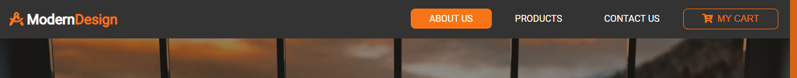<br/>
* for small screen<br/>
  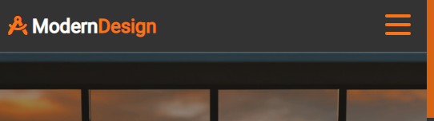<br/>
  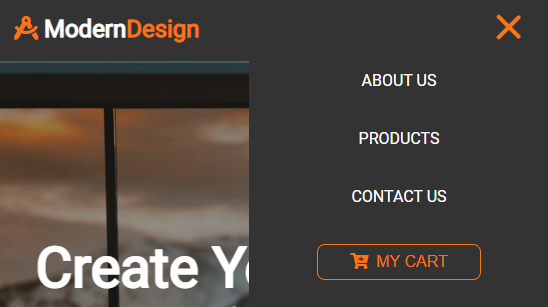<br/>


#### Step 1
Create **components** folder in **src** folder for your components. If you're going to use **module.css** files for styling then add **Navbar** folder in **components** and create **index.js** and **Navbar.module.css** files there
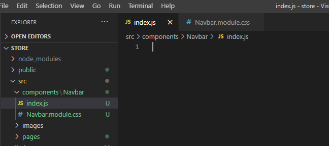<br/>

#### Step 2
* Type `rafce` in **index.js** for creating your component and change default code
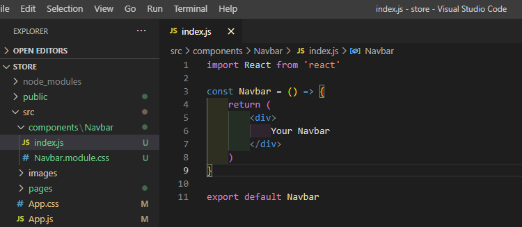<br/>
* Import **Navbar** into **App.js**. We place it on top of the `Switch` in order to display it for each page
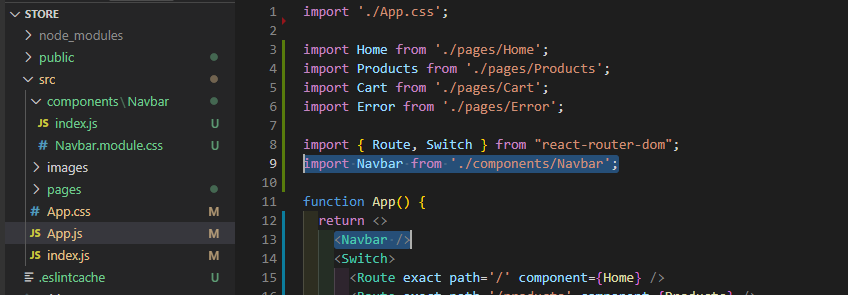<br/>

#### Step 3
Give a structure for navbar in **index.js**
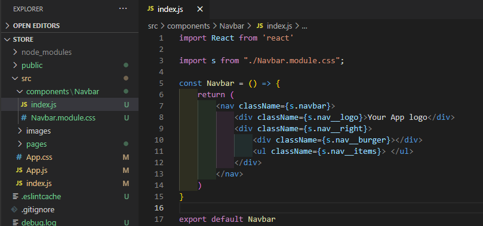<br/>
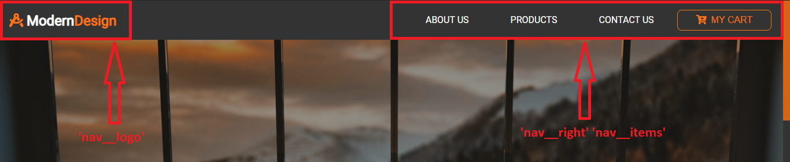<br/>
And style it in **Navbar.module.css**
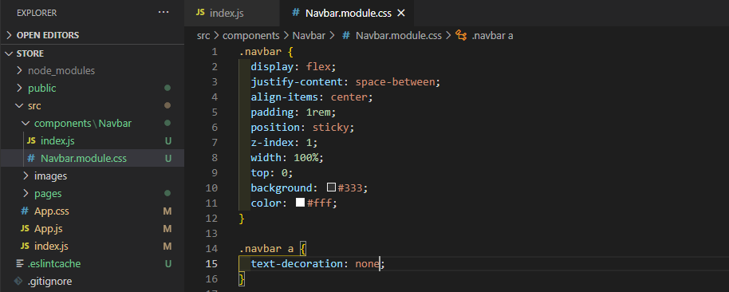<br/>

#### Step 4
Working on **'nav__logo'** part
* Replace `div` element on `h1` and add company name in **index.js**
```HTML
<h1 className={s.nav__logo}>
  Modern <span className='text-primary'>Design</span>
</h1>
```
Style it in **Navbar.module.css**
```CSS
.nav__logo {
  color: #fff;
  align-self: center;
}
```
Add `text-primary` class into **App.css** to highlight some parts
```CSS
.text-primary {
  color: #f77516;
}
```
* Add some icon from **[react-icons](https://react-icons.github.io/react-icons)**<br/>
Make sure you installed it (look at **package.json** file)
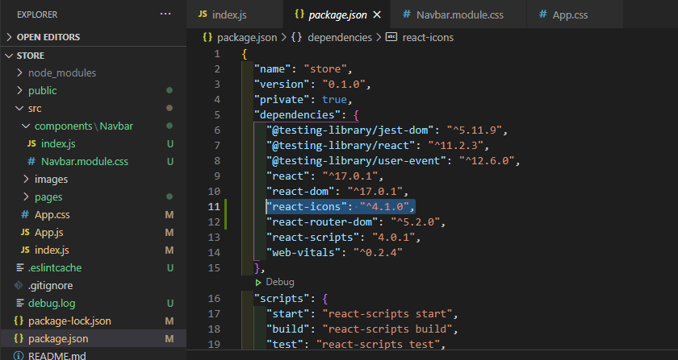<br/>
Add icon you chose into **index.js**
```Javascript
import { FaDraftingCompass } from 'react-icons/fa';

// your code

<h1 className={s.nav__logo}>
  <span className='text-primary'><FaDraftingCompass /></span>{" "}
  Modern <span className='text-primary'>Design</span>
</h1>
````
* Add a link for this item with **[react-router-dom](https://reactrouter.com/web/guides/quick-start)** (make sure you installed it)
```Javascript
import { Link } from 'react-router-dom';

// your code
<Link to='/'>
  <h1 className={s.nav__logo}>
    <span className='text-primary'><FaDraftingCompass /></span>{" "}
    Modern <span className='text-primary'>Design</span>
  </h1>
</Link>
````
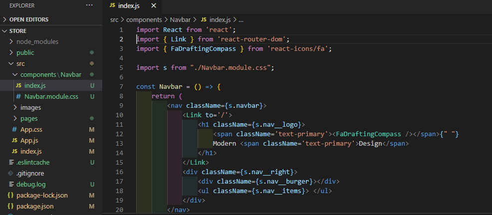<br/>
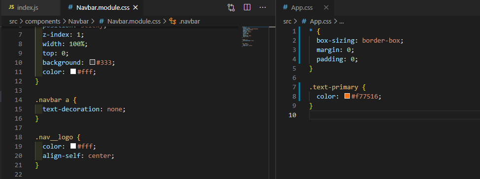<br/>
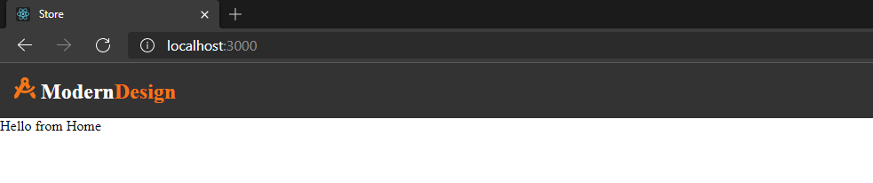<br/>
