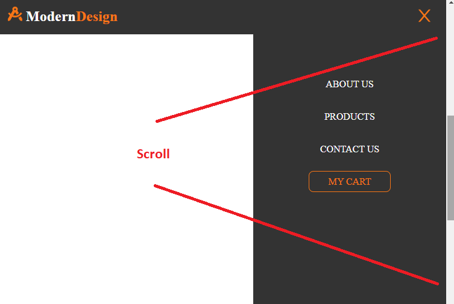
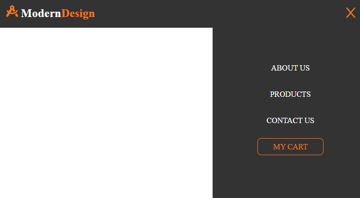

# ReactSnippet: How To

---

## Prevent SCROLL When The Nav Menu is Open

---

### Description
When the navigation menu is open, the user does not need to scroll the web page. Scrolling through the page on some websites makes the user interface ugly. So it's better to disable scrolling

Instead of this
<br/>

We want to have this one
<br/>

Since our menu is handled by **Burger.js** (see [Build A Responsive NAVBAR in React](https://github.com/andrewsinelnikov/ReactSnippet-How-To/edit/main/task4/README.md)) we will add a solution there.

### Step 1
To perform side effect (in this case, hiding scroll) we will use us [the Effect Hook](https://reactjs.org/docs/hooks-effect.html)
````Javascript
import React, {useEffect} from 'react';
import { AiOutlineClose, AiOutlineMenu } from 'react-icons/ai';

import s from "./Navbar.module.css";

const Burger = ({ open, setOpen }) => {
    useEffect(() => {
        
      }, []);

    return (
    
// code after
````
