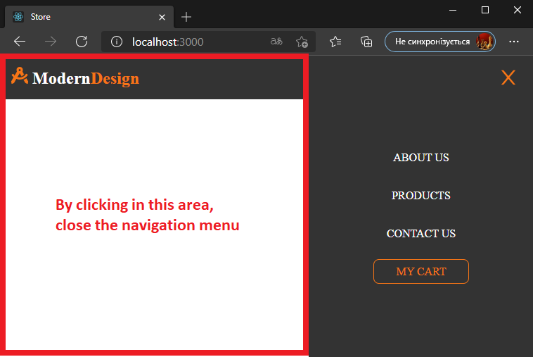

# ReactSnippet: How To

---

## Close Menu When Clicking OUTSIDE

---

### Description
Sometimes a user, having opened the navigation menu, wants to stay on the current web page. It is necessary to provide for the possibility of closing the menu when clicking outside its borders

<br/>

### Step 1
To detect the sidebar menu we will use **useRef()** (see [useRef Hook](https://reactjs.org/docs/hooks-reference.html#useref)) in **Navbar.js**. We can have access to needed element by creating a React reference and passing it to the element itself
````Javascript
import React, { useState, useRef } from 'react';
// your imports

const Navbar = () => {
    const [open, setOpen] = useState(false);
    const node = useRef(); 
    return (
        <nav className={s.navbar}>
            <Link to='/'>
                // code for logo
            </Link>
            <div ref={node}>
                <Burger open={open} setOpen={setOpen}/>
                <NavItems  open={open} setOpen={setOpen}/>
            </div>
        </nav>
    
// code after
````
