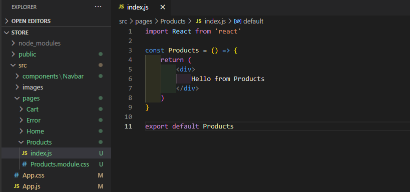
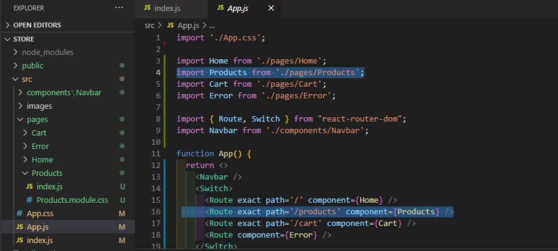
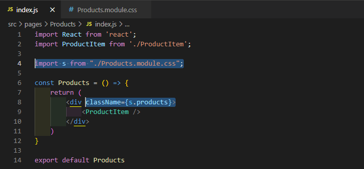
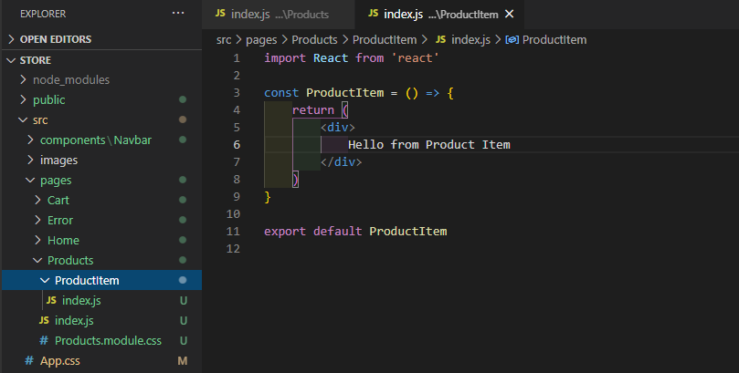
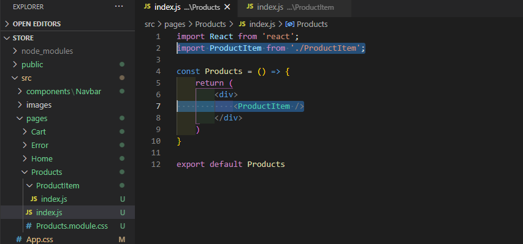

# ReactSnippet: How To

---

## Create a Product CARD

---

### Description
The product card is designed to showcase e-commerce products. We'll create a single card

### Step 1
In order to display a list products we need a component **Products**. So let's make it `rafce` command

<br/>

Add path for this component into **App.js**

<br/>

Style your card list in **Products.module.css**

<br/>
<br/>

### Step 2
Create **ProductItem** component to display a single product card

<br/>

Add **ProductItem** component into **Products.js**

<br/>

### Step 3
Give a html structure to your card in **ProductItem.js**

````HTML
<div className='card'>
    <div className='card__top'>
        <a href='#!'>
            </img>
        </a>
    </div>
    <div className='card__footer'>
      <p>Title</p>
      <h5><span>$</span> 6</h5>
    </div>
</div>
````
Here we saved our images in the next folders **public -> img ->** image files

### Step 4
Set card data through `props`
