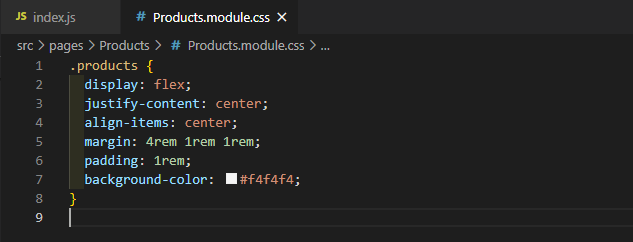
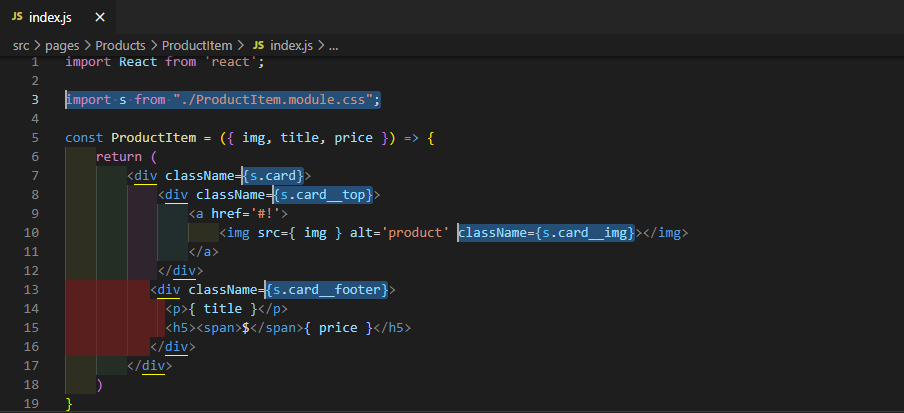

# ReactSnippet: How To

---

## Create a Product CARD

---

### Description
The product card is designed to showcase e-commerce products. We'll create a single card

### Step 1
In order to display a list products we need a component **Products**. So let's make it `rafce` command

<br/>

Add path for this component into **App.js**

<br/>

Style your card list in **Products.module.css**

<br/>
<br/>

### Step 2
Create **ProductItem** component to display a single product card

<br/>

Add **ProductItem** component into **Products.js**

<br/>

### Step 3
Give a html structure to your card in **ProductItem.js**

````HTML
<div className='card'>
    <div className='card__top'>
        <a href='#!'>
            </img>
        </a>
    </div>
    <div className='card__footer'>
      <p>Title</p>
      <h5><span>$</span> 6</h5>
    </div>
</div>
````
Here we saved our images in the next folders **public -> img ->** image files

### Step 4
Set card data through `props`

<br/>
<br/>

Now we have
<br/>

### Step 5
Style your card

* Give names for classes
<br/>

* Add style into **ProductItem.module.css**
````CSS
.card {
  width: 15rem;
  position: relative;
  background-color: #fff;
  margin: 0.5rem;
  display: flex;
  flex-direction: column;
  border: 1px solid transparent;
  border-radius: 0.25rem;
  transition: all 1s linear;
}

.card:hover {
  border: 0.04rem solid rgba(0, 0, 0, 0.2);
  box-shadow: 2px 2px 5px 0px rgba(0, 0, 0, 0.2);
}

.card:hover .card__footer {
  background: rgba(247, 247, 247);
}

.card__top {
  position: relative;
  overflow: hidden;
}

.card__img {
  width: 100%;
  border-top-left-radius: calc(0.25rem - 1px);
  border-top-right-radius: calc(0.25rem - 1px);
  transition: all 1s linear;
}

.card__top:hover .card__img {
  transform: scale(1.2);
}

.card__footer {
  display: flex;
  justify-content: space-between;
  padding: 0.75rem 1.25rem;
  background: transparent;
  border-top: transparent;
  transition: all 1s linear;
}
.card__footer p {
  align-self: center;
  margin-bottom: 0;
  margin-top: 0;
}
.card__footer h5 {
  font-style: italic;
  font-size: 1.25rem;
  line-height: 1.5;
  margin-bottom: 0;
}
.card__footer h5 span {
  margin-right: 0.25rem;
}
````

You've done it 🔥!
<br/>

Source files 📁 [here](https://github.com/andrewsinelnikov/ReactSnippet-How-To/tree/main/task7/src)

#### Got a question ❓   [✉️](https://twitter.com/Andrew79361148)

Want to know more? 👉 [Read next](https://github.com/andrewsinelnikov/ReactSnippet-How-To/blob/main/README.md)
