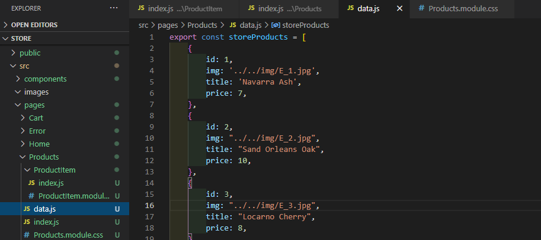
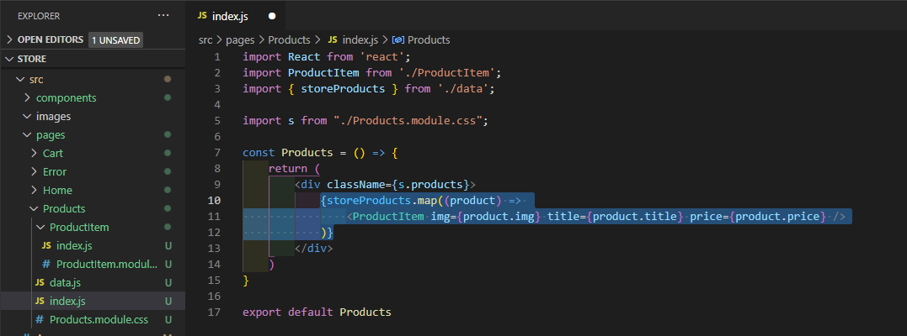

# ReactSnippet: How To

---

## Render Product LIST

---

### Description
A product list is needed to give an overview of a company’s goods.<br />
Easy to build it by listing items like this
````HTML
const Products = () => {
    return (
        <div className={s.products}>
            <ProductItem img='../../img/E_1.jpg' title='Navarra Ash' price={7}/>
            <ProductItem img='../../img/E_2.jpg' title='Sand Orleans Oak' price={10}/>
            <ProductItem img='../../img/E_3.jpg' title='Locarno Cherry' price={8}/>
            <ProductItem img='../../img/E_4.jpg' title='Black Sparkle Grain' price={15}/>
            <ProductItem img='../../img/E_5.jpg' title='Yellow' price={7}/>
        </div>
    )
}
````
What if the list were hundreds, thousands, or even millions of items? Then the list will be difficult to maintain and update. Reducing the amount of code is considered best programming practice. Therefore, we will save the list data separately, and allow the component that displays the list to efficiently do its work (in this manual, we will store product information locally)

### Step 1
Save product information in a separate file **Products -> data.js**

<br/>

Add data for product list, where the list - an array, each product - an object
````Javascript
export const storeProducts = [
    {
        id: 1,
        img: '../../img/E_1.jpg',
        title: 'Navarra Ash', 
        price: 7,
    },
    {
        id: 2,
        img: "../../img/E_2.jpg",
        title: "Sand Orleans Oak",
        price: 10,
    },
    {
        id: 3,
        img: "../../img/E_3.jpg",
        title: "Locarno Cherry",
        price: 8,
    },
    {
        id: 4,
        img: "../../img/E_4.jpg",
        title: "Black Sparkle Grain",
        price: 15,
    },
    {
        id: 5,
        img: "../../img/E_5.jpg",
        title: "Yellow",
        price: 7,
    },
    {
        id: 6,
        img: "../../img/E_6.jpg",
        title: "China Red",
        price: 6,
    },
    {
        id: 7,
        img: "../../img/E_7.jpg",
        title: "Delft Blue",
        price: 7,
    },
    {
        id: 8,
        img: "../../img/KS_1.jpg",
        title: "Loredo Pine",
        price: 15,
    },
    {
        id: 9,
        img: "../../img/KS_2.jpg",
        title: "Redwood",
        price: 19,
    },
    {
        id: 10,
        img: "../../img/KS_3.jpg",
        title: "Pear Red",
        price: 16,
    },
];
````

Since images for products a located in **public -> img** folder we set a path in the next way: for E_1.jpg image we set a path `'../../img/E_1.jpg'`

<br/>
