# ReactSnippet: How To
---

## Make a Contact FORM with a MAP
---

### Description
Forms play an important role in user feedback. How to create a form with React? How do I add a map to visualize contact information?
Our goal to get a page, as shown in the illustration below

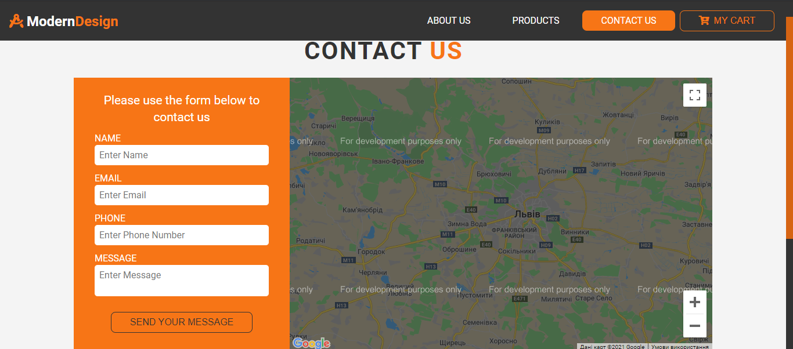 

### Step 1
Add **Contact** folder for the required components in **pages** folder and create main component for this page
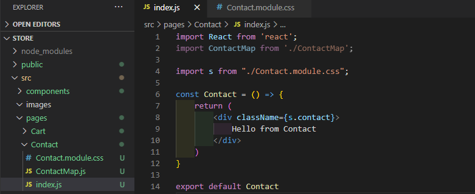 
Add a route for the page
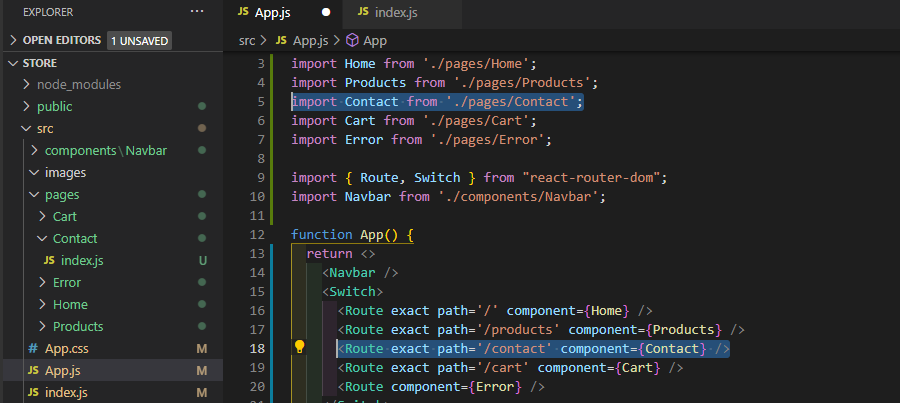 
And some style for the page in **Contact.module.css**
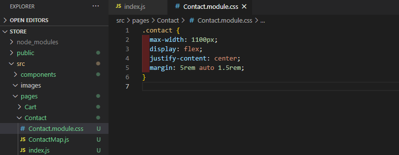 

### Step 2 (Map section)
* Create component **ContactMap** to show map
  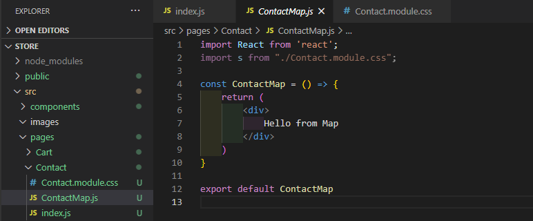 
  and import into **Contact** component
  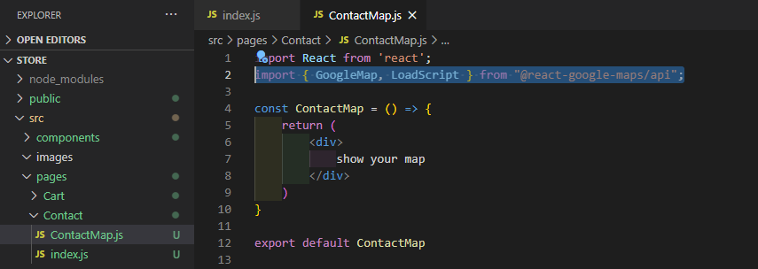 

* Choose or enter needed location on [Google Maps](https://maps.google.com/)
  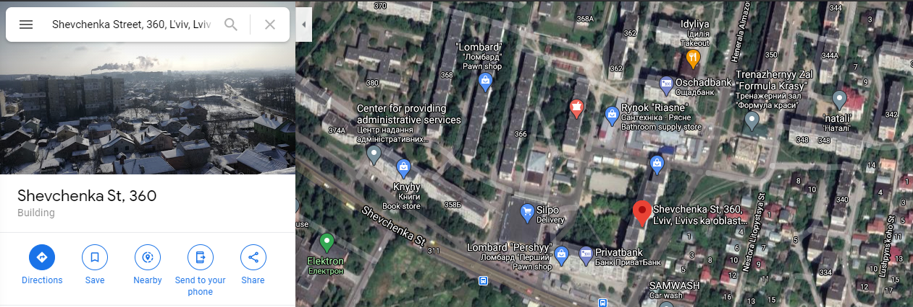 
  Click **Share or embed map** on **Menu** and from **Embed a map** tab copy html code 
   
  Paste the code into **ContactMap.js** 
  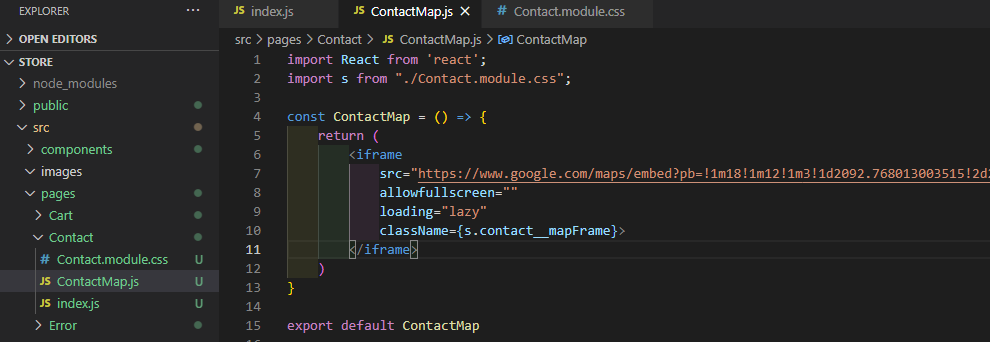 
  Style the frame 
  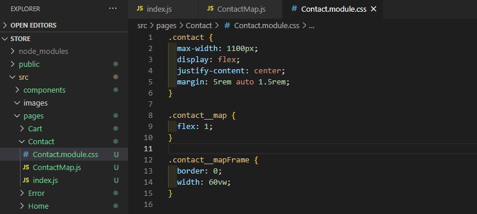 

### Step 3 (Form section)
* Create component **ContactForm** and import into **Contact**  
  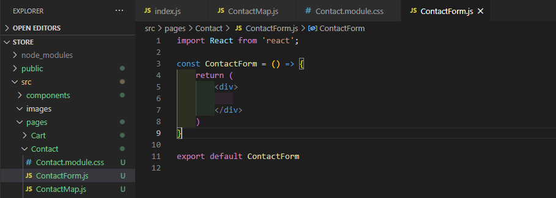 
  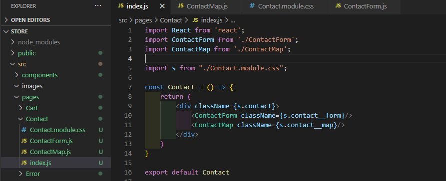 
  
