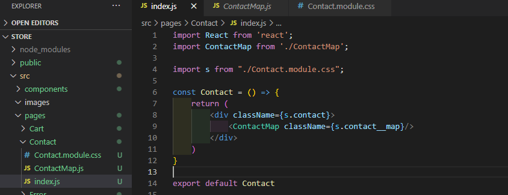

# ReactSnippet: How To
---

## Make a Contact FORM with a MAP
---

### Description
Forms play an important role in user feedback. How to create a form with React? How do I add a map to visualize contact information?
Our goal to get a page, as shown in the illustration below

 

### Step 1
Add **Contact** folder for the required components in **pages** folder and create main component for this page
 
Add a route for the page
 
And some style for the page in **Contact.module.css**
 

### Step 2 (Map display)
* Create component **ContactMap** to show map
   
  and import into **Contact** component
   

* Install @react-google-maps/api to your app with command
  `npm i -S @react-google-maps/api`
  and import needed elements from that library
   

* Style your map and give required position
   
* In order to use Google Maps API you need API key. [How to get an API key](https://developers.google.com/maps/documentation/javascript/adding-a-google-map#step_3_get_an_api_key)
* 
